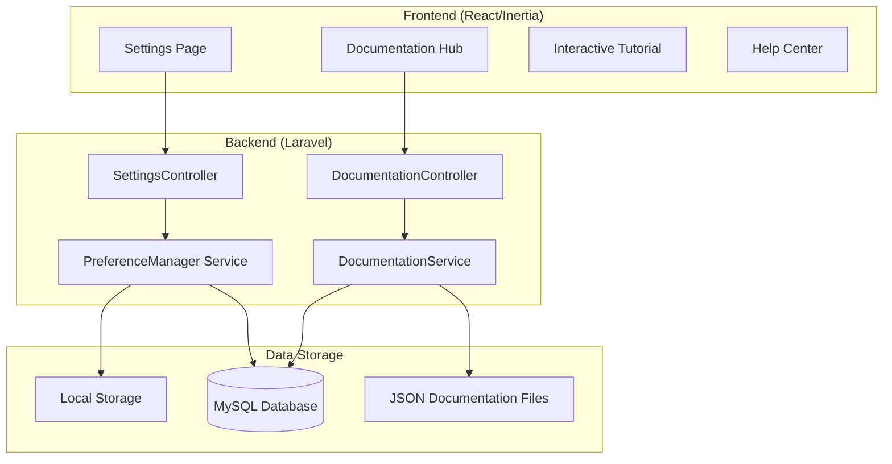

# Design Document: Advanced Settings & Documentation System

## Overview

Sistem ini menyediakan halaman pengaturan yang komprehensif dan pusat dokumentasi interaktif untuk aplikasi absensi akademik. Fitur ini dirancang untuk meningkatkan pengalaman pengguna dengan memberikan kontrol penuh atas preferensi aplikasi dan panduan lengkap untuk setiap fitur.

### Key Design Goals

1. **User-Centric**: Antarmuka yang intuitif dan mudah digunakan
2. **Comprehensive**: Mencakup semua aspek pengaturan dan dokumentasi
3. **Interactive**: Tutorial dan panduan yang interaktif
4. **Performant**: Pencarian cepat dan loading yang optimal
5. **Accessible**: Mendukung berbagai ukuran layar dan preferensi aksesibilitas

## Architecture



## Components and Interfaces

### Frontend Components

#### 1. SettingsPage Component

```typescript
interface SettingsPageProps {
  user: User;
  settings: UserSettings;
  role: 'dosen' | 'mahasiswa';
}

interface UserSettings {
  general: GeneralSettings;
  notifications: NotificationSettings;
  appearance: AppearanceSettings;
  privacy: PrivacySettings;
  security: SecuritySettings;
  dataManagement: DataManagementSettings;
}

interface GeneralSettings {
  language: 'id' | 'en';
  timezone: string;
  dateFormat: string;
  startOfWeek: 'sunday' | 'monday';
}

interface NotificationSettings {
  email: {
    enabled: boolean;
    attendance: boolean;
    tasks: boolean;
    announcements: boolean;
    reminders: boolean;
  };
  push: {
    enabled: boolean;
    attendance: boolean;
    tasks: boolean;
    chat: boolean;
  };
  inApp: {
    enabled: boolean;
    sound: boolean;
    vibration: boolean;
  };
}

interface AppearanceSettings {
  theme: 'light' | 'dark' | 'system';
  fontSize: 'small' | 'medium' | 'large';
  compactMode: boolean;
  animations: boolean;
  highContrast: boolean;
}

interface PrivacySettings {
  profileVisibility: 'public' | 'contacts' | 'private';
  showOnlineStatus: boolean;
  showLastSeen: boolean;
  shareActivity: boolean;
  allowSearchByNim: boolean;
}

interface SecuritySettings {
  twoFactorEnabled: boolean;
  activeSessions: Session[];
  loginHistory: LoginEntry[];
  trustedDevices: Device[];
}

interface DataManagementSettings {
  storageUsed: number;
  storageLimit: number;
  cacheSize: number;
  autoBackup: boolean;
  backupFrequency: 'daily' | 'weekly' | 'monthly';
}
```

#### 2. DocumentationHub Component

```typescript
interface DocumentationHubProps {
  role: 'dosen' | 'mahasiswa';
  guides: MenuGuide[];
  readProgress: ReadProgress[];
}

interface MenuGuide {
  id: string;
  menuKey: string;
  title: string;
  description: string;
  icon: string;
  category: 'core' | 'academic' | 'communication' | 'analytics' | 'finance';
  sections: GuideSection[];
  lastUpdated: string;
  version: string;
  estimatedReadTime: number;
}

interface GuideSection {
  id: string;
  title: string;
  type: 'overview' | 'features' | 'tutorial' | 'tips' | 'faq';
  content: string;
  steps?: TutorialStep[];
  faqs?: FAQ[];
}

interface TutorialStep {
  stepNumber: number;
  title: string;
  description: string;
  image?: string;
  highlightSelector?: string;
  action?: 'click' | 'input' | 'scroll' | 'wait';
}

interface FAQ {
  question: string;
  answer: string;
  tags: string[];
}

interface ReadProgress {
  guideId: string;
  completedSections: string[];
  lastReadAt: string;
  isCompleted: boolean;
}
```

#### 3. InteractiveTutorial Component

```typescript
interface InteractiveTutorialProps {
  tutorialId: string;
  steps: TutorialStep[];
  onComplete: () => void;
  onSkip: () => void;
}

interface TutorialState {
  currentStep: number;
  isActive: boolean;
  completedSteps: number[];
  skipped: boolean;
}
```

#### 4. HelpCenter Component

```typescript
interface HelpCenterProps {
  faqs: FAQCategory[];
  troubleshootingGuides: TroubleshootingGuide[];
  contactInfo: ContactInfo;
}

interface FAQCategory {
  id: string;
  name: string;
  icon: string;
  faqs: FAQ[];
}

interface TroubleshootingGuide {
  id: string;
  title: string;
  problem: string;
  solution: string[];
  relatedGuides: string[];
}

interface ContactInfo {
  email: string;
  phone?: string;
  whatsapp?: string;
  supportHours: string;
}
```

### Backend Services

#### 1. PreferenceManager Service

```php
interface PreferenceManagerInterface
{
    public function getSettings(int $userId, string $role): UserSettings;
    public function updateSettings(int $userId, string $role, array $settings): bool;
    public function resetToDefaults(int $userId, string $role): bool;
    public function exportSettings(int $userId, string $role): array;
    public function importSettings(int $userId, string $role, array $settings): bool;
}
```

#### 2. DocumentationService

```php
interface DocumentationServiceInterface
{
    public function getGuides(string $role): Collection;
    public function getGuide(string $guideId, string $role): ?MenuGuide;
    public function searchGuides(string $query, string $role): Collection;
    public function trackProgress(int $userId, string $guideId, array $completedSections): bool;
    public function getProgress(int $userId): Collection;
}
```

## Data Models

### UserPreference Model

```php
// Migration
Schema::create('user_preferences', function (Blueprint $table) {
    $table->id();
    $table->morphs('preferable'); // user_id + user_type (Mahasiswa/Dosen/User)
    $table->string('category'); // general, notifications, appearance, privacy, security, data
    $table->json('settings');
    $table->timestamps();
    
    $table->unique(['preferable_id', 'preferable_type', 'category']);
});
```

### DocumentationProgress Model

```php
// Migration
Schema::create('documentation_progress', function (Blueprint $table) {
    $table->id();
    $table->morphs('reader'); // user_id + user_type
    $table->string('guide_id');
    $table->json('completed_sections');
    $table->boolean('is_completed')->default(false);
    $table->timestamp('last_read_at');
    $table->timestamps();
    
    $table->unique(['reader_id', 'reader_type', 'guide_id']);
});
```

### TutorialCompletion Model

```php
// Migration
Schema::create('tutorial_completions', function (Blueprint $table) {
    $table->id();
    $table->morphs('learner');
    $table->string('tutorial_id');
    $table->boolean('completed')->default(false);
    $table->boolean('skipped')->default(false);
    $table->timestamp('completed_at')->nullable();
    $table->timestamps();
    
    $table->unique(['learner_id', 'learner_type', 'tutorial_id']);
});
```

## Correctness Properties

*A property is a characteristic or behavior that should hold true across all valid executions of a system-essentially, a formal statement about what the system should do. Properties serve as the bridge between human-readable specifications and machine-verifiable correctness guarantees.*

### Property 1: Settings Persistence Round-Trip

*For any* valid UserSettings object, serializing to JSON then deserializing back SHALL produce an equivalent object with all properties preserved.

**Validates: Requirements 7.3**

### Property 2: Settings Update Persistence

*For any* valid setting modification by a user, the change SHALL be persisted to the database and retrievable in subsequent requests.

**Validates: Requirements 1.2, 7.1**

### Property 3: Settings Rollback on Failure

*For any* failed setting update operation, the system SHALL revert to the previous valid state and the user SHALL see the original value.

**Validates: Requirements 1.8**

### Property 4: Documentation Search Relevance

*For any* search query in the Documentation Hub or Help Center, all returned results SHALL contain the search term in their title, description, or content.

**Validates: Requirements 2.2, 6.2**

### Property 5: Role-Based Documentation Filtering

*For any* user with a specific role (dosen/mahasiswa), the Documentation Hub SHALL only return guides that are applicable to that role.

**Validates: Requirements 2.6**

### Property 6: Guide Structure Completeness

*For any* MenuGuide in the system, it SHALL contain all required sections: Overview, Features, Tutorial, Tips & Best Practices, and FAQ.

**Validates: Requirements 2.3**

### Property 7: Progress Tracking Consistency

*For any* guide or tutorial marked as completed by a user, the completion status SHALL be persisted and retrievable across sessions.

**Validates: Requirements 2.5, 5.5**

### Property 8: Tutorial State Management

*For any* tutorial interaction (start, advance, skip, complete), the state change SHALL be persisted and the tutorial SHALL resume from the correct state on next access.

**Validates: Requirements 5.3, 5.4, 5.5**

### Property 9: Settings Sync Across Sessions

*For any* settings update, all active sessions for the same user SHALL receive the updated settings within a reasonable time frame.

**Validates: Requirements 7.4**

### Property 10: Fallback Storage Consistency

*For any* settings saved to local storage during database unavailability, syncing to database when connection is restored SHALL result in consistent state.

**Validates: Requirements 7.5**

### Property 11: Documentation Versioning

*For any* documentation update, the version number SHALL be incremented and the previous version SHALL remain accessible.

**Validates: Requirements 8.2**

### Property 12: Localization Completeness

*For any* documentation guide, translations SHALL exist for all supported languages (Indonesian, English) with equivalent content structure.

**Validates: Requirements 8.4**


## Error Handling

### Frontend Error Handling

```typescript
// Settings error handling
interface SettingsError {
  code: 'VALIDATION_ERROR' | 'NETWORK_ERROR' | 'SERVER_ERROR' | 'UNAUTHORIZED';
  message: string;
  field?: string;
  originalValue?: any;
}

// Error recovery strategies
const errorHandlers = {
  VALIDATION_ERROR: (error: SettingsError) => {
    // Show inline validation error
    // Revert field to original value
  },
  NETWORK_ERROR: (error: SettingsError) => {
    // Save to local storage
    // Queue for retry
    // Show offline indicator
  },
  SERVER_ERROR: (error: SettingsError) => {
    // Show toast notification
    // Revert to previous state
    // Log error for debugging
  },
  UNAUTHORIZED: (error: SettingsError) => {
    // Redirect to login
    // Clear local state
  }
};
```

### Backend Error Handling

```php
// Exception types
class SettingsValidationException extends Exception {}
class SettingsPersistenceException extends Exception {}
class DocumentationNotFoundException extends Exception {}

// Error responses
return response()->json([
    'success' => false,
    'error' => [
        'code' => 'VALIDATION_ERROR',
        'message' => 'Invalid setting value',
        'field' => 'notifications.email.enabled',
        'details' => $validator->errors()
    ]
], 422);
```

### Fallback Mechanisms

1. **Database Unavailable**: Use localStorage with sync queue
2. **Documentation Not Found**: Show default/fallback content
3. **Search Timeout**: Return cached results or suggest manual browsing
4. **Tutorial Asset Missing**: Skip step with notification

## Testing Strategy

### Unit Tests

Unit tests will verify specific examples and edge cases:

1. **Settings Validation Tests**
   - Test each setting type with valid/invalid values
   - Test boundary conditions (min/max values)
   - Test required vs optional fields

2. **Documentation Parsing Tests**
   - Test JSON/Markdown parsing
   - Test section extraction
   - Test search indexing

3. **Progress Tracking Tests**
   - Test completion marking
   - Test progress calculation
   - Test state persistence

### Property-Based Tests

Property-based tests will use **fast-check** library for TypeScript and **PHPUnit with Faker** for PHP.

Each property test will run minimum 100 iterations.

**Test Configuration:**
```typescript
// fast-check configuration
fc.configureGlobal({
  numRuns: 100,
  verbose: true
});
```

**Property Test Annotations:**
Each test will be tagged with: `Feature: advanced-settings-documentation, Property {number}: {property_text}`

### Integration Tests

1. **Settings Flow Tests**
   - Test complete settings update flow
   - Test settings sync across sessions
   - Test fallback to localStorage

2. **Documentation Flow Tests**
   - Test search and navigation
   - Test progress tracking across pages
   - Test tutorial completion flow

3. **API Tests**
   - Test all settings endpoints
   - Test documentation endpoints
   - Test progress tracking endpoints

## UI/UX Design

### Settings Page Layout

```
┌─────────────────────────────────────────────────────────────┐
│  ⚙️ Pengaturan                                    [Search]  │
├─────────────────────────────────────────────────────────────┤
│                                                             │
│  ┌─────────────┐  ┌─────────────────────────────────────┐  │
│  │ Categories  │  │  General Settings                    │  │
│  │             │  │                                      │  │
│  │ ○ General   │  │  Language        [Indonesian ▼]      │  │
│  │ ○ Notifikasi│  │  Timezone        [Asia/Jakarta ▼]    │  │
│  │ ○ Tampilan  │  │  Date Format     [DD/MM/YYYY ▼]      │  │
│  │ ○ Privasi   │  │  Start of Week   [Monday ▼]          │  │
│  │ ○ Keamanan  │  │                                      │  │
│  │ ○ Data      │  │  ─────────────────────────────────   │  │
│  │             │  │                                      │  │
│  │ ─────────── │  │  [Reset to Defaults]  [Save Changes] │  │
│  │ 📚 Docs     │  │                                      │  │
│  │ ❓ Help     │  └─────────────────────────────────────┘  │
│  └─────────────┘                                           │
│                                                             │
└─────────────────────────────────────────────────────────────┘
```

### Documentation Hub Layout

```
┌─────────────────────────────────────────────────────────────┐
│  📚 Dokumentasi                          [🔍 Cari panduan]  │
├─────────────────────────────────────────────────────────────┤
│                                                             │
│  Progress: ████████░░░░░░░░ 45% (6/13 panduan selesai)     │
│                                                             │
│  ┌─────────────────────────────────────────────────────┐   │
│  │ 📊 Core Features                                     │   │
│  │ ┌─────────┐ ┌─────────┐ ┌─────────┐ ┌─────────┐    │   │
│  │ │Dashboard│ │  Absen  │ │ Rekapan │ │ Riwayat │    │   │
│  │ │   ✓     │ │   ✓     │ │         │ │         │    │   │
│  │ └─────────┘ └─────────┘ └─────────┘ └─────────┘    │   │
│  └─────────────────────────────────────────────────────┘   │
│                                                             │
│  ┌─────────────────────────────────────────────────────┐   │
│  │ 📝 Academic                                          │   │
│  │ ┌─────────┐ ┌─────────┐ ┌─────────┐                │   │
│  │ │  Tugas  │ │Akademik │ │  Izin   │                │   │
│  │ │   ✓     │ │         │ │   ✓     │                │   │
│  │ └─────────┘ └─────────┘ └─────────┘                │   │
│  └─────────────────────────────────────────────────────┘   │
│                                                             │
└─────────────────────────────────────────────────────────────┘
```

### Menu Guide Detail Layout

```
┌─────────────────────────────────────────────────────────────┐
│  ← Kembali                                                  │
├─────────────────────────────────────────────────────────────┤
│                                                             │
│  📊 Dashboard                              🕐 5 menit baca  │
│  ─────────────────────────────────────────────────────────  │
│                                                             │
│  [Overview] [Fitur] [Tutorial] [Tips] [FAQ]                │
│                                                             │
│  ┌─────────────────────────────────────────────────────┐   │
│  │                                                      │   │
│  │  ## Overview                                         │   │
│  │                                                      │   │
│  │  Dashboard adalah halaman utama yang menampilkan    │   │
│  │  ringkasan aktivitas dan statistik penting Anda.    │   │
│  │                                                      │   │
│  │  ### Apa yang bisa Anda lihat:                      │   │
│  │  - Statistik kehadiran minggu ini                   │   │
│  │  - Tugas yang akan datang                           │   │
│  │  - Notifikasi terbaru                               │   │
│  │  - Progress pencapaian                              │   │
│  │                                                      │   │
│  │  [📷 Screenshot Dashboard]                          │   │
│  │                                                      │   │
│  └─────────────────────────────────────────────────────┘   │
│                                                             │
│  [← Sebelumnya]                        [Selanjutnya →]     │
│                                                             │
└─────────────────────────────────────────────────────────────┘
```

## Documentation Content Structure

### Dosen Menu Guides

```json
{
  "dosen_guides": [
    {
      "id": "dosen-dashboard",
      "menuKey": "dashboard",
      "title": "Dashboard Dosen",
      "category": "core",
      "sections": ["overview", "features", "tutorial", "tips", "faq"]
    },
    {
      "id": "dosen-sesi-absen",
      "menuKey": "sesi-absen",
      "title": "Sesi Absen",
      "category": "core"
    },
    {
      "id": "dosen-mata-kuliah",
      "menuKey": "courses",
      "title": "Mata Kuliah",
      "category": "academic"
    },
    {
      "id": "dosen-tugas",
      "menuKey": "tugas",
      "title": "Informasi Tugas",
      "category": "academic"
    },
    {
      "id": "dosen-permits",
      "menuKey": "permits",
      "title": "Persetujuan Izin",
      "category": "academic"
    },
    {
      "id": "dosen-verify",
      "menuKey": "verify",
      "title": "Verifikasi",
      "category": "core"
    },
    {
      "id": "dosen-rekapan",
      "menuKey": "rekapan",
      "title": "Rekapan",
      "category": "analytics"
    },
    {
      "id": "dosen-grading",
      "menuKey": "grading",
      "title": "Penilaian",
      "category": "academic"
    },
    {
      "id": "dosen-class-insights",
      "menuKey": "class-insights",
      "title": "Class Insights",
      "category": "analytics"
    },
    {
      "id": "dosen-session-templates",
      "menuKey": "session-templates",
      "title": "Session Templates",
      "category": "core"
    },
    {
      "id": "dosen-notifications",
      "menuKey": "notifications",
      "title": "Notifikasi",
      "category": "communication"
    },
    {
      "id": "dosen-chat",
      "menuKey": "chat",
      "title": "Chat",
      "category": "communication"
    }
  ]
}
```

### Mahasiswa Menu Guides

```json
{
  "mahasiswa_guides": [
    {
      "id": "mahasiswa-dashboard",
      "menuKey": "dashboard",
      "title": "Dashboard Mahasiswa",
      "category": "core"
    },
    {
      "id": "mahasiswa-absen",
      "menuKey": "absen",
      "title": "Absen",
      "category": "core"
    },
    {
      "id": "mahasiswa-rekapan",
      "menuKey": "rekapan",
      "title": "Rekapan",
      "category": "core"
    },
    {
      "id": "mahasiswa-history",
      "menuKey": "history",
      "title": "Riwayat",
      "category": "core"
    },
    {
      "id": "mahasiswa-tugas",
      "menuKey": "tugas",
      "title": "Informasi Tugas",
      "category": "academic"
    },
    {
      "id": "mahasiswa-permit",
      "menuKey": "permit",
      "title": "Izin/Sakit",
      "category": "academic"
    },
    {
      "id": "mahasiswa-akademik",
      "menuKey": "akademik",
      "title": "Akademik",
      "category": "academic"
    },
    {
      "id": "mahasiswa-personal-analytics",
      "menuKey": "personal-analytics",
      "title": "Personal Analytics",
      "category": "analytics"
    },
    {
      "id": "mahasiswa-achievements",
      "menuKey": "achievements",
      "title": "Pencapaian",
      "category": "analytics"
    },
    {
      "id": "mahasiswa-leaderboard",
      "menuKey": "leaderboard",
      "title": "Leaderboard",
      "category": "analytics"
    },
    {
      "id": "mahasiswa-kas",
      "menuKey": "kas",
      "title": "Uang Kas",
      "category": "finance"
    },
    {
      "id": "mahasiswa-kas-voting",
      "menuKey": "kas-voting",
      "title": "Voting Kas",
      "category": "finance"
    },
    {
      "id": "mahasiswa-chat",
      "menuKey": "chat",
      "title": "Chat",
      "category": "communication"
    }
  ]
}
```

## API Endpoints

### Settings API

```
GET    /api/settings                    - Get all user settings
PUT    /api/settings                    - Update all settings
PATCH  /api/settings/{category}         - Update specific category
POST   /api/settings/reset              - Reset to defaults
GET    /api/settings/export             - Export settings as JSON
POST   /api/settings/import             - Import settings from JSON
```

### Documentation API

```
GET    /api/docs/guides                 - Get all guides for role
GET    /api/docs/guides/{id}            - Get specific guide
GET    /api/docs/search?q={query}       - Search guides
GET    /api/docs/progress               - Get user's reading progress
POST   /api/docs/progress/{guideId}     - Update reading progress
```

### Tutorial API

```
GET    /api/tutorials                   - Get all tutorials
GET    /api/tutorials/{id}              - Get specific tutorial
POST   /api/tutorials/{id}/start        - Start tutorial
POST   /api/tutorials/{id}/complete     - Complete tutorial
POST   /api/tutorials/{id}/skip         - Skip tutorial
GET    /api/tutorials/status            - Get completion status
```

### Help Center API

```
GET    /api/help/faqs                   - Get all FAQs
GET    /api/help/faqs/{category}        - Get FAQs by category
GET    /api/help/search?q={query}       - Search FAQs
GET    /api/help/troubleshooting        - Get troubleshooting guides
POST   /api/help/feedback               - Submit feedback/question
```
