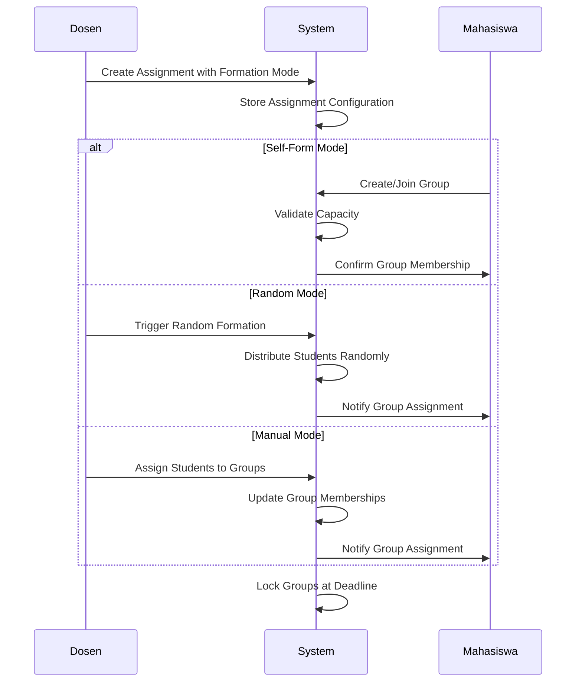
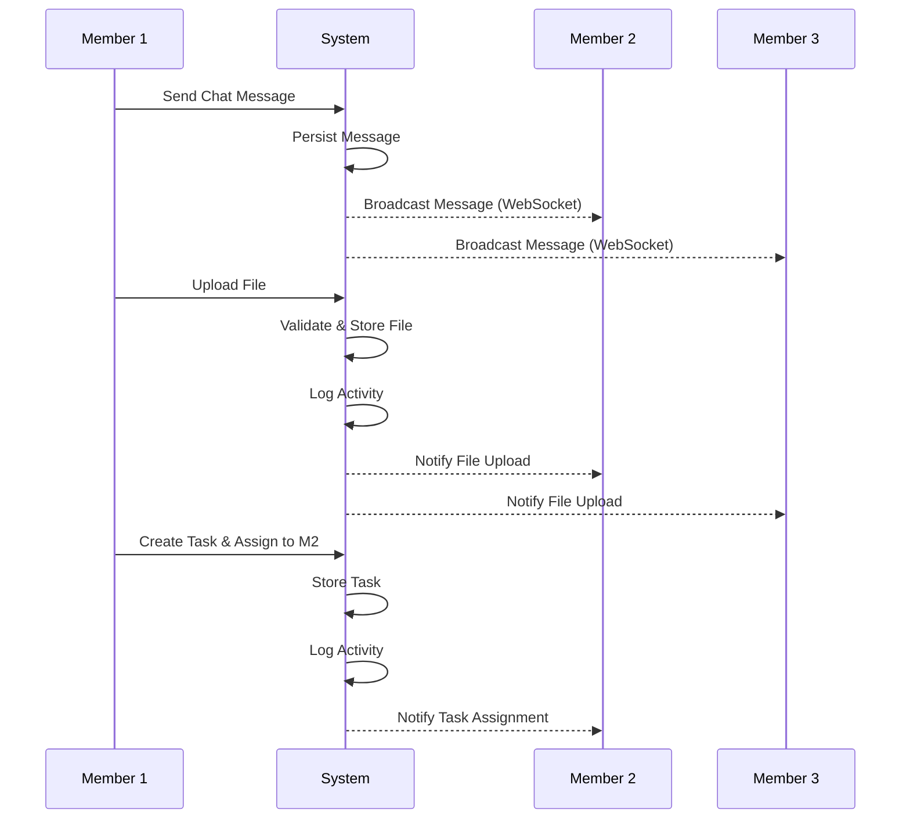
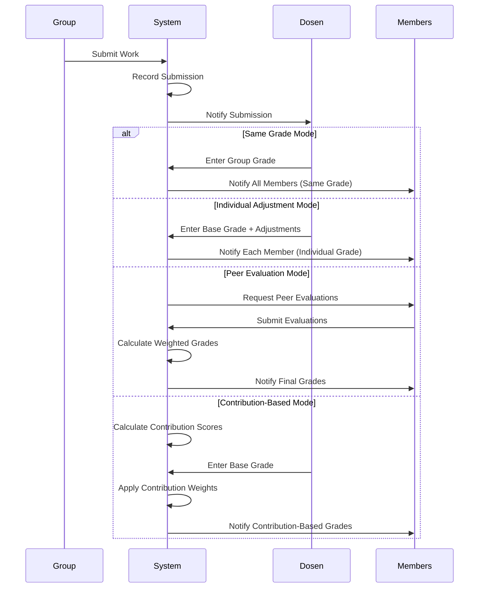

# Design Document: Group Assignment Management System

## Overview

The Group Assignment Management System is a comprehensive platform for managing collaborative academic work. The system provides three distinct group formation modes (self-form, random, manual), real-time collaboration features (chat, task distribution, file sharing), flexible grading options (same grade, individual adjustments, peer evaluation, contribution-based), and detailed analytics for monitoring group dynamics and individual contributions.

### Key Design Principles

1. **Flexibility**: Support multiple formation and grading modes to accommodate different teaching styles
2. **Real-time Collaboration**: Enable seamless communication and coordination within groups
3. **Fair Assessment**: Provide tools to evaluate individual contributions within group work
4. **Transparency**: Make group activities and contributions visible to all stakeholders
5. **Scalability**: Handle multiple assignments with many groups efficiently

### Technology Stack

- **Frontend**: React with TypeScript, Inertia.js, Framer Motion for animations
- **Backend**: Laravel (PHP), Laravel Echo for real-time features
- **Database**: MySQL/PostgreSQL with proper indexing for performance
- **Real-time**: Laravel Reverb (WebSocket server) for chat and live updates
- **Storage**: Laravel filesystem for file uploads with cloud storage support
- **Caching**: Redis for session management and real-time data


## Architecture

### System Architecture

```mermaid
graph TB
    subgraph "Frontend Layer"
        DosenUI[Dosen Interface]
        MahasiswaUI[Mahasiswa Interface]
    end
    
    subgraph "Application Layer"
        AssignmentController[Assignment Controller]
        GroupController[Group Controller]
        ChatController[Chat Controller]
        GradingController[Grading Controller]
    end
    
    subgraph "Service Layer"
        GroupFormationService[Group Formation Service]
        CollaborationService[Collaboration Service]
        GradingService[Grading Service]
        AnalyticsService[Analytics Service]
        NotificationService[Notification Service]
    end
    
    subgraph "Data Layer"
        Database[(Database)]
        FileStorage[(File Storage)]
        Cache[(Redis Cache)]
    end
    
    subgraph "Real-time Layer"
        WebSocketServer[Laravel Reverb]
        EventBroadcaster[Event Broadcaster]
    end
    
    DosenUI --> AssignmentController
    DosenUI --> GradingController
    MahasiswaUI --> GroupController
    MahasiswaUI --> ChatController
    
    AssignmentController --> GroupFormationService
    GroupController --> CollaborationService
    ChatController --> CollaborationService
    GradingController --> GradingService
    
    GroupFormationService --> Database
    CollaborationService --> Database
    CollaborationService --> FileStorage
    CollaborationService --> WebSocketServer
    GradingService --> Database
    GradingService --> AnalyticsService
    AnalyticsService --> Database
    AnalyticsService --> Cache
    NotificationService --> EventBroadcaster
    
    WebSocketServer --> EventBroadcaster
    EventBroadcaster --> DosenUI
    EventBroadcaster --> MahasiswaUI
```



### Component Interaction Flow

**Group Formation Flow:**


**Collaboration Flow:**


**Grading Flow:**



## Components and Interfaces

### Frontend Components

#### 1. Dosen Interface (`resources/js/pages/dosen/tugas-kelompok.tsx`)

**Main Assignment Management Page:**
```typescript
interface AssignmentListProps {
  assignments: Assignment[];
  statistics: AssignmentStatistics;
}

interface Assignment {
  id: string;
  title: string;
  description: string;
  course_id: string;
  course_name: string;
  formation_mode: 'self-form' | 'random' | 'manual';
  grading_mode: 'same' | 'individual' | 'peer' | 'contribution';
  min_members: number;
  max_members: number;
  formation_deadline: string;
  submission_deadline: string;
  total_groups: number;
  submitted_groups: number;
  features: {
    chat_enabled: boolean;
    task_distribution_enabled: boolean;
    peer_evaluation_enabled: boolean;
    gamification_enabled: boolean;
  };
  created_at: string;
}

interface AssignmentStatistics {
  total_assignments: number;
  active_assignments: number;
  total_groups: number;
  submission_rate: number;
  average_grade: number;
}
```

**Assignment Creation Form:**
```typescript
interface AssignmentFormData {
  title: string;
  description: string;
  course_id: string;
  formation_mode: 'self-form' | 'random' | 'manual';
  grading_mode: 'same' | 'individual' | 'peer' | 'contribution';
  min_members: number;
  max_members: number;
  formation_deadline: Date;
  submission_deadline: Date;
  max_file_size_mb: number;
  allowed_file_types: string[];
  features: {
    chat_enabled: boolean;
    task_distribution_enabled: boolean;
    peer_evaluation_enabled: boolean;
    gamification_enabled: boolean;
  };
  peer_evaluation_weight?: number; // 0-50%
  contribution_threshold?: number; // 0-100%
  allow_resubmission: boolean;
  reference_materials: File[];
}
```

**Group Management Interface:**
```typescript
interface GroupManagementProps {
  assignment: Assignment;
  groups: Group[];
  unassigned_students: Student[];
}

interface Group {
  id: string;
  name: string;
  leader_id: string;
  members: GroupMember[];
  progress: number; // 0-100%
  submission_status: 'not_started' | 'in_progress' | 'submitted' | 'graded';
  submitted_at?: string;
  grade?: number;
  activity_summary: {
    total_messages: number;
    total_files: number;
    total_tasks: number;
    last_activity: string;
  };
}

interface GroupMember {
  id: string;
  student_id: string;
  name: string;
  nim: string;
  is_leader: boolean;
  contribution_score: number;
  contribution_percentage: number;
  activity_count: {
    messages: number;
    files: number;
    tasks_completed: number;
  };
  peer_evaluation_score?: number;
  final_grade?: number;
}
```

**Analytics Dashboard:**
```typescript
interface AnalyticsDashboardProps {
  assignment: Assignment;
  analytics: AssignmentAnalytics;
}

interface AssignmentAnalytics {
  overview: {
    total_groups: number;
    submitted_groups: number;
    submission_rate: number;
    average_grade: number;
    grade_distribution: { range: string; count: number }[];
  };
  contribution_analysis: {
    average_contribution_variance: number;
    high_contributors: GroupMember[];
    low_contributors: GroupMember[];
    contribution_distribution: { member_id: string; score: number }[];
  };
  activity_timeline: {
    date: string;
    messages: number;
    files: number;
    tasks: number;
  }[];
  group_performance: {
    group_id: string;
    group_name: string;
    progress: number;
    grade?: number;
    submission_timeliness: 'early' | 'on-time' | 'late';
  }[];
  peer_evaluation_summary?: {
    average_score: number;
    score_distribution: { score: number; count: number }[];
    correlation_with_grades: number;
  };
}
```

#### 2. Mahasiswa Interface (`resources/js/pages/user/akademik/tugas-kelompok.tsx`)

**Group View Page:**
```typescript
interface GroupViewProps {
  assignment: Assignment;
  group: Group;
  current_user_id: string;
  is_leader: boolean;
}

interface GroupChatMessage {
  id: string;
  sender_id: string;
  sender_name: string;
  sender_avatar?: string;
  content: string;
  type: 'text' | 'system' | 'file';
  attachment?: FileAttachment;
  reply_to?: {
    message_id: string;
    content: string;
    sender_name: string;
  };
  reactions: { emoji: string; user_ids: string[] }[];
  is_edited: boolean;
  is_deleted: boolean;
  created_at: string;
  read_by: string[];
}

interface FileAttachment {
  id: string;
  filename: string;
  original_name: string;
  file_type: string;
  file_size: number;
  uploaded_by: string;
  uploaded_at: string;
  download_url: string;
  thumbnail_url?: string;
}

interface GroupTask {
  id: string;
  title: string;
  description?: string;
  assigned_to: string[];
  created_by: string;
  status: 'pending' | 'in_progress' | 'completed';
  deadline?: string;
  completed_at?: string;
  completed_by?: string;
}
```

**Group Formation Interface (Self-Form Mode):**
```typescript
interface GroupFormationProps {
  assignment: Assignment;
  available_groups: AvailableGroup[];
  current_group?: Group;
  can_create_group: boolean;
  can_join_group: boolean;
  formation_deadline: string;
}

interface AvailableGroup {
  id: string;
  name: string;
  leader_name: string;
  current_members: number;
  max_members: number;
  is_full: boolean;
  members: { name: string; nim: string }[];
}
```

**Peer Evaluation Interface:**
```typescript
interface PeerEvaluationProps {
  assignment: Assignment;
  group: Group;
  teammates: GroupMember[];
  evaluation_deadline: string;
}

interface PeerEvaluationForm {
  evaluations: {
    member_id: string;
    criteria: {
      contribution: number; // 1-5
      communication: number; // 1-5
      reliability: number; // 1-5
      quality: number; // 1-5
    };
    comments?: string;
  }[];
}
```

### Backend Components

#### 1. Controllers

**TugasKelompokController (Dosen):**
```php
class TugasKelompokController extends Controller
{
    public function index(): Response;
    public function create(): Response;
    public function store(StoreAssignmentRequest $request): RedirectResponse;
    public function show(string $id): Response;
    public function edit(string $id): Response;
    public function update(UpdateAssignmentRequest $request, string $id): RedirectResponse;
    public function destroy(string $id): RedirectResponse;
    
    // Group management
    public function manageGroups(string $assignmentId): Response;
    public function formRandomGroups(string $assignmentId): JsonResponse;
    public function assignStudentToGroup(AssignGroupRequest $request): JsonResponse;
    public function moveStudentBetweenGroups(MoveStudentRequest $request): JsonResponse;
    
    // Grading
    public function gradeSubmission(GradeSubmissionRequest $request, string $submissionId): JsonResponse;
    public function bulkGrade(BulkGradeRequest $request, string $assignmentId): JsonResponse;
    
    // Analytics
    public function analytics(string $assignmentId): Response;
    public function exportAnalytics(string $assignmentId): BinaryFileResponse;
    
    // Conflict resolution
    public function viewConflicts(string $assignmentId): Response;
    public function resolveConflict(ResolveConflictRequest $request, string $conflictId): JsonResponse;
}
```

**TugasKelompokController (Mahasiswa):**
```php
class TugasKelompokController extends Controller
{
    public function index(): Response;
    public function show(string $assignmentId): Response;
    
    // Group formation (self-form mode)
    public function createGroup(CreateGroupRequest $request, string $assignmentId): JsonResponse;
    public function joinGroup(string $groupId): JsonResponse;
    public function leaveGroup(string $groupId): JsonResponse;
    
    // Collaboration
    public function sendMessage(SendMessageRequest $request, string $groupId): JsonResponse;
    public function uploadFile(UploadFileRequest $request, string $groupId): JsonResponse;
    public function createTask(CreateTaskRequest $request, string $groupId): JsonResponse;
    public function updateTaskStatus(string $taskId, string $status): JsonResponse;
    
    // Submission
    public function submitWork(SubmitWorkRequest $request, string $groupId): JsonResponse;
    
    // Peer evaluation
    public function submitPeerEvaluation(PeerEvaluationRequest $request, string $assignmentId): JsonResponse;
    
    // Conflict reporting
    public function reportConflict(ReportConflictRequest $request, string $groupId): JsonResponse;
}
```

#### 2. Services

**GroupFormationService:**
```php
class GroupFormationService
{
    public function createSelfFormGroup(
        string $assignmentId,
        string $studentId,
        string $groupName
    ): Group;
    
    public function joinGroup(string $groupId, string $studentId): bool;
    
    public function formRandomGroups(
        string $assignmentId,
        int $minMembers,
        int $maxMembers,
        bool $balancedDistribution = false
    ): array;
    
    public function manualAssignStudent(
        string $groupId,
        string $studentId
    ): bool;
    
    public function moveStudentBetweenGroups(
        string $studentId,
        string $fromGroupId,
        string $toGroupId
    ): bool;
    
    public function lockGroups(string $assignmentId): void;
    
    public function validateGroupCapacity(string $groupId): bool;
    
    public function assignUnassignedStudents(
        string $assignmentId,
        string $strategy = 'solo' // 'solo' or 'fill_incomplete'
    ): void;
}
```

**CollaborationService:**
```php
class CollaborationService
{
    public function sendMessage(
        string $groupId,
        string $senderId,
        string $content,
        ?string $replyToId = null
    ): Message;
    
    public function uploadFile(
        string $groupId,
        string $uploaderId,
        UploadedFile $file
    ): FileAttachment;
    
    public function createTask(
        string $groupId,
        string $creatorId,
        string $title,
        array $assignedTo,
        ?string $description = null,
        ?string $deadline = null
    ): Task;
    
    public function updateTaskStatus(
        string $taskId,
        string $status,
        string $userId
    ): Task;
    
    public function deleteMessage(string $messageId, string $userId): bool;
    
    public function addReaction(
        string $messageId,
        string $userId,
        string $emoji
    ): void;
    
    public function logActivity(
        string $groupId,
        string $userId,
        string $activityType,
        array $metadata = []
    ): ActivityLog;
    
    public function getGroupMessages(
        string $groupId,
        int $page = 1,
        int $perPage = 50
    ): array;
}
```

**GradingService:**
```php
class GradingService
{
    public function gradeSameForAll(
        string $submissionId,
        float $grade,
        ?string $notes = null
    ): array;
    
    public function gradeWithIndividualAdjustments(
        string $submissionId,
        float $baseGrade,
        array $adjustments // ['student_id' => ['adjustment' => +5, 'note' => '...']]
    ): array;
    
    public function calculatePeerEvaluationGrades(
        string $assignmentId,
        float $baseGrade,
        float $peerWeight // 0-0.5
    ): array;
    
    public function calculateContributionBasedGrades(
        string $submissionId,
        float $baseGrade,
        float $minThreshold = 0.3
    ): array;
    
    public function getContributionScores(string $groupId): array;
    
    public function validateGrade(float $grade): bool;
    
    public function notifyGrades(string $submissionId): void;
}
```

**AnalyticsService:**
```php
class AnalyticsService
{
    public function getAssignmentAnalytics(string $assignmentId): AssignmentAnalytics;
    
    public function getGroupProgressMetrics(string $groupId): array;
    
    public function getIndividualContributionMetrics(
        string $groupId,
        string $studentId
    ): array;
    
    public function calculateContributionScores(string $groupId): array;
    
    public function getActivityTimeline(
        string $groupId,
        ?string $startDate = null,
        ?string $endDate = null
    ): array;
    
    public function generateContributionReport(string $assignmentId): array;
    
    public function exportAnalyticsToPDF(string $assignmentId): string;
    
    public function exportAnalyticsToExcel(string $assignmentId): string;
    
    public function identifyInactiveMembers(
        string $groupId,
        int $inactiveDays = 3
    ): array;
}
```

**NotificationService:**
```php
class NotificationService
{
    public function notifyGroupAssignment(string $studentId, string $groupId): void;
    
    public function notifyNewMessage(string $groupId, string $messageId, string $senderId): void;
    
    public function notifyTaskAssignment(string $studentId, string $taskId): void;
    
    public function notifyFileUpload(string $groupId, string $fileId, string $uploaderId): void;
    
    public function notifyDeadlineApproaching(string $assignmentId, int $hoursRemaining): void;
    
    public function notifySubmissionGraded(string $submissionId): void;
    
    public function notifyConflictReported(string $dosenId, string $conflictId): void;
    
    public function sendBulkNotifications(array $userIds, string $message, array $data): void;
}
```

#### 3. Real-time Events

**WebSocket Events:**
```php
// Chat events
event(new MessageSent($groupId, $message));
event(new UserTyping($groupId, $userId));
event(new MessageRead($messageId, $userId));

// Group events
event(new MemberJoined($groupId, $member));
event(new MemberLeft($groupId, $memberId));
event(new TaskCreated($groupId, $task));
event(new TaskStatusChanged($taskId, $status));

// File events
event(new FileUploaded($groupId, $file));

// Activity events
event(new ActivityLogged($groupId, $activity));
```

**Event Listeners:**
```php
class MessageSentListener
{
    public function handle(MessageSent $event): void
    {
        // Broadcast to group members via WebSocket
        // Log activity
        // Send notifications to offline members
        // Update unread counts
    }
}

class TaskCreatedListener
{
    public function handle(TaskCreated $event): void
    {
        // Broadcast to group members
        // Notify assigned members
        // Log activity
    }
}
```


## Data Models

### Database Schema

#### assignments Table
```sql
CREATE TABLE assignments (
    id CHAR(36) PRIMARY KEY,
    dosen_id CHAR(36) NOT NULL,
    course_id CHAR(36) NOT NULL,
    title VARCHAR(255) NOT NULL,
    description TEXT,
    formation_mode ENUM('self-form', 'random', 'manual') NOT NULL,
    grading_mode ENUM('same', 'individual', 'peer', 'contribution') NOT NULL,
    min_members INT NOT NULL,
    max_members INT NOT NULL,
    formation_deadline TIMESTAMP NOT NULL,
    submission_deadline TIMESTAMP NOT NULL,
    max_file_size_mb INT DEFAULT 25,
    allowed_file_types JSON,
    features JSON, -- {chat_enabled, task_distribution_enabled, etc.}
    peer_evaluation_weight DECIMAL(3,2) DEFAULT NULL, -- 0.00-0.50
    contribution_threshold DECIMAL(3,2) DEFAULT 0.30,
    allow_resubmission BOOLEAN DEFAULT FALSE,
    is_locked BOOLEAN DEFAULT FALSE,
    created_at TIMESTAMP DEFAULT CURRENT_TIMESTAMP,
    updated_at TIMESTAMP DEFAULT CURRENT_TIMESTAMP ON UPDATE CURRENT_TIMESTAMP,
    
    FOREIGN KEY (dosen_id) REFERENCES users(id) ON DELETE CASCADE,
    FOREIGN KEY (course_id) REFERENCES courses(id) ON DELETE CASCADE,
    INDEX idx_dosen_course (dosen_id, course_id),
    INDEX idx_deadlines (formation_deadline, submission_deadline)
);
```

#### groups Table
```sql
CREATE TABLE groups (
    id CHAR(36) PRIMARY KEY,
    assignment_id CHAR(36) NOT NULL,
    name VARCHAR(255) NOT NULL,
    leader_id CHAR(36) NOT NULL,
    is_locked BOOLEAN DEFAULT FALSE,
    created_at TIMESTAMP DEFAULT CURRENT_TIMESTAMP,
    updated_at TIMESTAMP DEFAULT CURRENT_TIMESTAMP ON UPDATE CURRENT_TIMESTAMP,
    
    FOREIGN KEY (assignment_id) REFERENCES assignments(id) ON DELETE CASCADE,
    FOREIGN KEY (leader_id) REFERENCES users(id) ON DELETE CASCADE,
    INDEX idx_assignment (assignment_id),
    UNIQUE KEY unique_group_name (assignment_id, name)
);
```

#### group_members Table
```sql
CREATE TABLE group_members (
    id CHAR(36) PRIMARY KEY,
    group_id CHAR(36) NOT NULL,
    student_id CHAR(36) NOT NULL,
    is_leader BOOLEAN DEFAULT FALSE,
    joined_at TIMESTAMP DEFAULT CURRENT_TIMESTAMP,
    
    FOREIGN KEY (group_id) REFERENCES groups(id) ON DELETE CASCADE,
    FOREIGN KEY (student_id) REFERENCES users(id) ON DELETE CASCADE,
    UNIQUE KEY unique_student_per_assignment (group_id, student_id),
    INDEX idx_group (group_id),
    INDEX idx_student (student_id)
);
```

#### group_messages Table
```sql
CREATE TABLE group_messages (
    id CHAR(36) PRIMARY KEY,
    group_id CHAR(36) NOT NULL,
    sender_id CHAR(36) NOT NULL,
    content TEXT,
    type ENUM('text', 'system', 'file') DEFAULT 'text',
    reply_to_id CHAR(36) DEFAULT NULL,
    attachment_id CHAR(36) DEFAULT NULL,
    is_edited BOOLEAN DEFAULT FALSE,
    is_deleted BOOLEAN DEFAULT FALSE,
    created_at TIMESTAMP DEFAULT CURRENT_TIMESTAMP,
    updated_at TIMESTAMP DEFAULT CURRENT_TIMESTAMP ON UPDATE CURRENT_TIMESTAMP,
    
    FOREIGN KEY (group_id) REFERENCES groups(id) ON DELETE CASCADE,
    FOREIGN KEY (sender_id) REFERENCES users(id) ON DELETE CASCADE,
    FOREIGN KEY (reply_to_id) REFERENCES group_messages(id) ON DELETE SET NULL,
    FOREIGN KEY (attachment_id) REFERENCES group_files(id) ON DELETE SET NULL,
    INDEX idx_group_created (group_id, created_at DESC),
    INDEX idx_sender (sender_id)
);
```

#### group_message_reads Table
```sql
CREATE TABLE group_message_reads (
    id CHAR(36) PRIMARY KEY,
    message_id CHAR(36) NOT NULL,
    user_id CHAR(36) NOT NULL,
    read_at TIMESTAMP DEFAULT CURRENT_TIMESTAMP,
    
    FOREIGN KEY (message_id) REFERENCES group_messages(id) ON DELETE CASCADE,
    FOREIGN KEY (user_id) REFERENCES users(id) ON DELETE CASCADE,
    UNIQUE KEY unique_read (message_id, user_id),
    INDEX idx_message (message_id),
    INDEX idx_user (user_id)
);
```

#### group_message_reactions Table
```sql
CREATE TABLE group_message_reactions (
    id CHAR(36) PRIMARY KEY,
    message_id CHAR(36) NOT NULL,
    user_id CHAR(36) NOT NULL,
    emoji VARCHAR(10) NOT NULL,
    created_at TIMESTAMP DEFAULT CURRENT_TIMESTAMP,
    
    FOREIGN KEY (message_id) REFERENCES group_messages(id) ON DELETE CASCADE,
    FOREIGN KEY (user_id) REFERENCES users(id) ON DELETE CASCADE,
    UNIQUE KEY unique_reaction (message_id, user_id, emoji),
    INDEX idx_message (message_id)
);
```

#### group_tasks Table
```sql
CREATE TABLE group_tasks (
    id CHAR(36) PRIMARY KEY,
    group_id CHAR(36) NOT NULL,
    title VARCHAR(255) NOT NULL,
    description TEXT,
    created_by CHAR(36) NOT NULL,
    status ENUM('pending', 'in_progress', 'completed') DEFAULT 'pending',
    deadline TIMESTAMP DEFAULT NULL,
    completed_at TIMESTAMP DEFAULT NULL,
    completed_by CHAR(36) DEFAULT NULL,
    created_at TIMESTAMP DEFAULT CURRENT_TIMESTAMP,
    updated_at TIMESTAMP DEFAULT CURRENT_TIMESTAMP ON UPDATE CURRENT_TIMESTAMP,
    
    FOREIGN KEY (group_id) REFERENCES groups(id) ON DELETE CASCADE,
    FOREIGN KEY (created_by) REFERENCES users(id) ON DELETE CASCADE,
    FOREIGN KEY (completed_by) REFERENCES users(id) ON DELETE SET NULL,
    INDEX idx_group_status (group_id, status),
    INDEX idx_deadline (deadline)
);
```

#### group_task_assignments Table
```sql
CREATE TABLE group_task_assignments (
    id CHAR(36) PRIMARY KEY,
    task_id CHAR(36) NOT NULL,
    student_id CHAR(36) NOT NULL,
    assigned_at TIMESTAMP DEFAULT CURRENT_TIMESTAMP,
    
    FOREIGN KEY (task_id) REFERENCES group_tasks(id) ON DELETE CASCADE,
    FOREIGN KEY (student_id) REFERENCES users(id) ON DELETE CASCADE,
    UNIQUE KEY unique_assignment (task_id, student_id),
    INDEX idx_task (task_id),
    INDEX idx_student (student_id)
);
```

#### group_files Table
```sql
CREATE TABLE group_files (
    id CHAR(36) PRIMARY KEY,
    group_id CHAR(36) NOT NULL,
    uploaded_by CHAR(36) NOT NULL,
    filename VARCHAR(255) NOT NULL,
    original_name VARCHAR(255) NOT NULL,
    file_path VARCHAR(500) NOT NULL,
    file_type VARCHAR(50) NOT NULL,
    file_size BIGINT NOT NULL,
    mime_type VARCHAR(100) NOT NULL,
    thumbnail_path VARCHAR(500) DEFAULT NULL,
    uploaded_at TIMESTAMP DEFAULT CURRENT_TIMESTAMP,
    
    FOREIGN KEY (group_id) REFERENCES groups(id) ON DELETE CASCADE,
    FOREIGN KEY (uploaded_by) REFERENCES users(id) ON DELETE CASCADE,
    INDEX idx_group_uploaded (group_id, uploaded_at DESC),
    INDEX idx_uploader (uploaded_by)
);
```

#### group_submissions Table
```sql
CREATE TABLE group_submissions (
    id CHAR(36) PRIMARY KEY,
    group_id CHAR(36) NOT NULL,
    assignment_id CHAR(36) NOT NULL,
    submitted_by CHAR(36) NOT NULL,
    submission_notes TEXT,
    submitted_at TIMESTAMP DEFAULT CURRENT_TIMESTAMP,
    is_late BOOLEAN DEFAULT FALSE,
    late_duration_minutes INT DEFAULT 0,
    grade DECIMAL(5,2) DEFAULT NULL,
    grading_notes TEXT DEFAULT NULL,
    graded_at TIMESTAMP DEFAULT NULL,
    graded_by CHAR(36) DEFAULT NULL,
    
    FOREIGN KEY (group_id) REFERENCES groups(id) ON DELETE CASCADE,
    FOREIGN KEY (assignment_id) REFERENCES assignments(id) ON DELETE CASCADE,
    FOREIGN KEY (submitted_by) REFERENCES users(id) ON DELETE CASCADE,
    FOREIGN KEY (graded_by) REFERENCES users(id) ON DELETE SET NULL,
    UNIQUE KEY unique_submission (group_id, assignment_id),
    INDEX idx_assignment_submitted (assignment_id, submitted_at),
    INDEX idx_grading_status (assignment_id, graded_at)
);
```

#### group_submission_files Table
```sql
CREATE TABLE group_submission_files (
    id CHAR(36) PRIMARY KEY,
    submission_id CHAR(36) NOT NULL,
    file_id CHAR(36) NOT NULL,
    
    FOREIGN KEY (submission_id) REFERENCES group_submissions(id) ON DELETE CASCADE,
    FOREIGN KEY (file_id) REFERENCES group_files(id) ON DELETE CASCADE,
    UNIQUE KEY unique_submission_file (submission_id, file_id)
);
```

#### peer_evaluations Table
```sql
CREATE TABLE peer_evaluations (
    id CHAR(36) PRIMARY KEY,
    assignment_id CHAR(36) NOT NULL,
    evaluator_id CHAR(36) NOT NULL,
    evaluated_id CHAR(36) NOT NULL,
    contribution_score TINYINT NOT NULL, -- 1-5
    communication_score TINYINT NOT NULL, -- 1-5
    reliability_score TINYINT NOT NULL, -- 1-5
    quality_score TINYINT NOT NULL, -- 1-5
    comments TEXT,
    submitted_at TIMESTAMP DEFAULT CURRENT_TIMESTAMP,
    
    FOREIGN KEY (assignment_id) REFERENCES assignments(id) ON DELETE CASCADE,
    FOREIGN KEY (evaluator_id) REFERENCES users(id) ON DELETE CASCADE,
    FOREIGN KEY (evaluated_id) REFERENCES users(id) ON DELETE CASCADE,
    UNIQUE KEY unique_evaluation (assignment_id, evaluator_id, evaluated_id),
    CHECK (evaluator_id != evaluated_id),
    CHECK (contribution_score BETWEEN 1 AND 5),
    CHECK (communication_score BETWEEN 1 AND 5),
    CHECK (reliability_score BETWEEN 1 AND 5),
    CHECK (quality_score BETWEEN 1 AND 5),
    INDEX idx_assignment_evaluated (assignment_id, evaluated_id)
);
```

#### activity_logs Table
```sql
CREATE TABLE activity_logs (
    id CHAR(36) PRIMARY KEY,
    group_id CHAR(36) NOT NULL,
    user_id CHAR(36) NOT NULL,
    activity_type ENUM('message', 'file_upload', 'task_created', 'task_completed', 'member_joined', 'member_left') NOT NULL,
    activity_metadata JSON,
    points INT DEFAULT 0, -- Contribution points
    created_at TIMESTAMP DEFAULT CURRENT_TIMESTAMP,
    
    FOREIGN KEY (group_id) REFERENCES groups(id) ON DELETE CASCADE,
    FOREIGN KEY (user_id) REFERENCES users(id) ON DELETE CASCADE,
    INDEX idx_group_created (group_id, created_at DESC),
    INDEX idx_user_type (user_id, activity_type),
    INDEX idx_created (created_at)
);
```

#### individual_grades Table
```sql
CREATE TABLE individual_grades (
    id CHAR(36) PRIMARY KEY,
    submission_id CHAR(36) NOT NULL,
    student_id CHAR(36) NOT NULL,
    base_grade DECIMAL(5,2) NOT NULL,
    adjustment DECIMAL(5,2) DEFAULT 0,
    peer_evaluation_score DECIMAL(5,2) DEFAULT NULL,
    contribution_score DECIMAL(5,2) DEFAULT NULL,
    final_grade DECIMAL(5,2) NOT NULL,
    grading_notes TEXT,
    
    FOREIGN KEY (submission_id) REFERENCES group_submissions(id) ON DELETE CASCADE,
    FOREIGN KEY (student_id) REFERENCES users(id) ON DELETE CASCADE,
    UNIQUE KEY unique_student_grade (submission_id, student_id),
    INDEX idx_submission (submission_id),
    INDEX idx_student (student_id)
);
```

#### conflict_reports Table
```sql
CREATE TABLE conflict_reports (
    id CHAR(36) PRIMARY KEY,
    group_id CHAR(36) NOT NULL,
    reporter_id CHAR(36) NOT NULL,
    description TEXT NOT NULL,
    involved_members JSON, -- Array of student IDs
    status ENUM('open', 'in_review', 'resolved') DEFAULT 'open',
    resolution_notes TEXT DEFAULT NULL,
    resolved_by CHAR(36) DEFAULT NULL,
    resolved_at TIMESTAMP DEFAULT NULL,
    created_at TIMESTAMP DEFAULT CURRENT_TIMESTAMP,
    
    FOREIGN KEY (group_id) REFERENCES groups(id) ON DELETE CASCADE,
    FOREIGN KEY (reporter_id) REFERENCES users(id) ON DELETE CASCADE,
    FOREIGN KEY (resolved_by) REFERENCES users(id) ON DELETE SET NULL,
    INDEX idx_group_status (group_id, status),
    INDEX idx_status (status)
);
```

#### achievements Table
```sql
CREATE TABLE achievements (
    id CHAR(36) PRIMARY KEY,
    code VARCHAR(50) UNIQUE NOT NULL,
    name VARCHAR(255) NOT NULL,
    description TEXT,
    icon VARCHAR(100),
    criteria JSON, -- Unlock criteria
    points INT DEFAULT 0,
    type ENUM('group', 'individual') NOT NULL,
    created_at TIMESTAMP DEFAULT CURRENT_TIMESTAMP
);
```

#### user_achievements Table
```sql
CREATE TABLE user_achievements (
    id CHAR(36) PRIMARY KEY,
    user_id CHAR(36) NOT NULL,
    achievement_id CHAR(36) NOT NULL,
    group_id CHAR(36) DEFAULT NULL,
    unlocked_at TIMESTAMP DEFAULT CURRENT_TIMESTAMP,
    
    FOREIGN KEY (user_id) REFERENCES users(id) ON DELETE CASCADE,
    FOREIGN KEY (achievement_id) REFERENCES achievements(id) ON DELETE CASCADE,
    FOREIGN KEY (group_id) REFERENCES groups(id) ON DELETE SET NULL,
    UNIQUE KEY unique_user_achievement (user_id, achievement_id, group_id),
    INDEX idx_user (user_id)
);
```

### Model Relationships

**Assignment Model:**
```php
class Assignment extends Model
{
    protected $fillable = [
        'dosen_id', 'course_id', 'title', 'description',
        'formation_mode', 'grading_mode', 'min_members', 'max_members',
        'formation_deadline', 'submission_deadline', 'features',
        'peer_evaluation_weight', 'contribution_threshold', 'allow_resubmission'
    ];
    
    protected $casts = [
        'features' => 'array',
        'allowed_file_types' => 'array',
        'formation_deadline' => 'datetime',
        'submission_deadline' => 'datetime',
        'is_locked' => 'boolean',
        'allow_resubmission' => 'boolean',
    ];
    
    public function dosen(): BelongsTo;
    public function course(): BelongsTo;
    public function groups(): HasMany;
    public function submissions(): HasMany;
    public function conflictReports(): HasMany;
}
```

**Group Model:**
```php
class Group extends Model
{
    protected $fillable = ['assignment_id', 'name', 'leader_id', 'is_locked'];
    
    protected $casts = [
        'is_locked' => 'boolean',
    ];
    
    public function assignment(): BelongsTo;
    public function leader(): BelongsTo;
    public function members(): HasMany;
    public function messages(): HasMany;
    public function tasks(): HasMany;
    public function files(): HasMany;
    public function activityLogs(): HasMany;
    public function submission(): HasOne;
    
    // Computed properties
    public function getMemberCountAttribute(): int;
    public function getProgressAttribute(): float;
    public function getContributionScoresAttribute(): array;
}
```

**GroupMember Model:**
```php
class GroupMember extends Model
{
    protected $fillable = ['group_id', 'student_id', 'is_leader'];
    
    protected $casts = [
        'is_leader' => 'boolean',
        'joined_at' => 'datetime',
    ];
    
    public function group(): BelongsTo;
    public function student(): BelongsTo;
    public function taskAssignments(): HasMany;
    public function activityLogs(): HasMany;
    
    // Computed properties
    public function getContributionScoreAttribute(): float;
    public function getActivityCountAttribute(): array;
}
```

**GroupMessage Model:**
```php
class GroupMessage extends Model
{
    protected $fillable = [
        'group_id', 'sender_id', 'content', 'type',
        'reply_to_id', 'attachment_id', 'is_edited', 'is_deleted'
    ];
    
    protected $casts = [
        'is_edited' => 'boolean',
        'is_deleted' => 'boolean',
    ];
    
    public function group(): BelongsTo;
    public function sender(): BelongsTo;
    public function replyTo(): BelongsTo;
    public function attachment(): BelongsTo;
    public function reads(): HasMany;
    public function reactions(): HasMany;
    
    // Computed properties
    public function getReadByAttribute(): array;
    public function getReactionSummaryAttribute(): array;
}
```

**GroupTask Model:**
```php
class GroupTask extends Model
{
    protected $fillable = [
        'group_id', 'title', 'description', 'created_by',
        'status', 'deadline', 'completed_at', 'completed_by'
    ];
    
    protected $casts = [
        'deadline' => 'datetime',
        'completed_at' => 'datetime',
    ];
    
    public function group(): BelongsTo;
    public function creator(): BelongsTo;
    public function completedBy(): BelongsTo;
    public function assignments(): HasMany;
    
    // Computed properties
    public function getAssignedMembersAttribute(): array;
    public function getIsOverdueAttribute(): bool;
}
```

**GroupSubmission Model:**
```php
class GroupSubmission extends Model
{
    protected $fillable = [
        'group_id', 'assignment_id', 'submitted_by', 'submission_notes',
        'is_late', 'late_duration_minutes', 'grade', 'grading_notes',
        'graded_by'
    ];
    
    protected $casts = [
        'submitted_at' => 'datetime',
        'graded_at' => 'datetime',
        'is_late' => 'boolean',
    ];
    
    public function group(): BelongsTo;
    public function assignment(): BelongsTo;
    public function submittedBy(): BelongsTo;
    public function gradedBy(): BelongsTo;
    public function files(): BelongsToMany;
    public function individualGrades(): HasMany;
}
```

**PeerEvaluation Model:**
```php
class PeerEvaluation extends Model
{
    protected $fillable = [
        'assignment_id', 'evaluator_id', 'evaluated_id',
        'contribution_score', 'communication_score',
        'reliability_score', 'quality_score', 'comments'
    ];
    
    protected $casts = [
        'submitted_at' => 'datetime',
    ];
    
    public function assignment(): BelongsTo;
    public function evaluator(): BelongsTo;
    public function evaluated(): BelongsTo;
    
    // Computed properties
    public function getAverageScoreAttribute(): float;
}
```

**ActivityLog Model:**
```php
class ActivityLog extends Model
{
    protected $fillable = [
        'group_id', 'user_id', 'activity_type',
        'activity_metadata', 'points'
    ];
    
    protected $casts = [
        'activity_metadata' => 'array',
    ];
    
    public function group(): BelongsTo;
    public function user(): BelongsTo;
}
```

### Data Validation Rules

**Assignment Validation:**
```php
class StoreAssignmentRequest extends FormRequest
{
    public function rules(): array
    {
        return [
            'title' => 'required|string|max:255',
            'description' => 'required|string',
            'course_id' => 'required|exists:courses,id',
            'formation_mode' => 'required|in:self-form,random,manual',
            'grading_mode' => 'required|in:same,individual,peer,contribution',
            'min_members' => 'required|integer|min:1|max:10',
            'max_members' => 'required|integer|min:1|max:20|gte:min_members',
            'formation_deadline' => 'required|date|after:now',
            'submission_deadline' => 'required|date|after:formation_deadline',
            'peer_evaluation_weight' => 'nullable|numeric|min:0|max:0.5',
            'contribution_threshold' => 'nullable|numeric|min:0|max:1',
            'features.chat_enabled' => 'boolean',
            'features.task_distribution_enabled' => 'boolean',
            'features.peer_evaluation_enabled' => 'boolean',
            'features.gamification_enabled' => 'boolean',
        ];
    }
}
```

**File Upload Validation:**
```php
class UploadFileRequest extends FormRequest
{
    public function rules(): array
    {
        return [
            'file' => [
                'required',
                'file',
                'max:25600', // 25MB in KB
                'mimes:pdf,doc,docx,xls,xlsx,ppt,pptx,jpg,jpeg,png,gif,zip'
            ],
        ];
    }
}
```

**Peer Evaluation Validation:**
```php
class PeerEvaluationRequest extends FormRequest
{
    public function rules(): array
    {
        return [
            'evaluations' => 'required|array|min:1',
            'evaluations.*.member_id' => 'required|exists:users,id',
            'evaluations.*.criteria.contribution' => 'required|integer|min:1|max:5',
            'evaluations.*.criteria.communication' => 'required|integer|min:1|max:5',
            'evaluations.*.criteria.reliability' => 'required|integer|min:1|max:5',
            'evaluations.*.criteria.quality' => 'required|integer|min:1|max:5',
            'evaluations.*.comments' => 'nullable|string|max:500',
        ];
    }
    
    public function withValidator($validator): void
    {
        $validator->after(function ($validator) {
            // Ensure evaluator is not evaluating themselves
            foreach ($this->evaluations as $evaluation) {
                if ($evaluation['member_id'] === auth()->id()) {
                    $validator->errors()->add(
                        'evaluations',
                        'You cannot evaluate yourself.'
                    );
                }
            }
        });
    }
}
```


## Error Handling

### Error Categories

#### 1. Validation Errors

**Group Formation Errors:**
- `GROUP_FULL`: Group has reached maximum capacity
- `INVALID_GROUP_SIZE`: Group size outside min/max bounds
- `FORMATION_LOCKED`: Formation deadline has passed
- `ALREADY_IN_GROUP`: Student already belongs to a group
- `INVALID_FORMATION_MODE`: Formation mode not allowed for this assignment

**File Upload Errors:**
- `FILE_TOO_LARGE`: File exceeds maximum size limit
- `INVALID_FILE_TYPE`: File type not in allowed list
- `STORAGE_QUOTA_EXCEEDED`: Group storage quota exceeded
- `UPLOAD_FAILED`: File upload process failed

**Grading Errors:**
- `INVALID_GRADE_RANGE`: Grade outside 0-100 range
- `SUBMISSION_NOT_FOUND`: Submission does not exist
- `ALREADY_GRADED`: Submission already has a grade
- `PEER_EVALUATION_INCOMPLETE`: Not all peer evaluations submitted

#### 2. Authorization Errors

**Access Control Errors:**
- `UNAUTHORIZED_ACCESS`: User not authorized for this operation
- `NOT_GROUP_MEMBER`: User is not a member of this group
- `NOT_GROUP_LEADER`: Operation requires group leader privileges
- `NOT_ASSIGNMENT_OWNER`: Only assignment creator can perform this action

#### 3. Business Logic Errors

**Submission Errors:**
- `NO_FILES_ATTACHED`: Submission requires at least one file
- `DEADLINE_PASSED`: Submission deadline has passed and resubmission not allowed
- `GROUP_INCOMPLETE`: Group does not meet minimum member requirement
- `ALREADY_SUBMITTED`: Group has already submitted work

**Task Distribution Errors:**
- `TASK_DISTRIBUTION_DISABLED`: Feature not enabled for this assignment
- `INVALID_ASSIGNEE`: Assigned user is not a group member
- `TASK_NOT_FOUND`: Task does not exist

#### 4. Real-time Communication Errors

**Chat Errors:**
- `CHAT_DISABLED`: Chat feature not enabled for this assignment
- `MESSAGE_TOO_LONG`: Message exceeds maximum length
- `WEBSOCKET_CONNECTION_FAILED`: Real-time connection could not be established
- `MESSAGE_DELIVERY_FAILED`: Message could not be delivered

### Error Response Format

```typescript
interface ErrorResponse {
  error: {
    code: string;
    message: string;
    details?: Record<string, string[]>;
    timestamp: string;
  };
}

// Example error responses
{
  "error": {
    "code": "GROUP_FULL",
    "message": "This group has reached maximum capacity",
    "details": {
      "current_members": "5",
      "max_members": "5"
    },
    "timestamp": "2026-03-02T10:30:00Z"
  }
}

{
  "error": {
    "code": "INVALID_GRADE_RANGE",
    "message": "Grade must be between 0 and 100",
    "details": {
      "provided_grade": "105",
      "valid_range": "0-100"
    },
    "timestamp": "2026-03-02T10:30:00Z"
  }
}
```

### Error Handling Strategies

#### Frontend Error Handling

```typescript
// Graceful error display with toast notifications
const handleError = (error: AxiosError<ErrorResponse>) => {
  const errorCode = error.response?.data?.error?.code;
  const errorMessage = error.response?.data?.error?.message;
  
  // Display user-friendly error message
  toast.error(errorMessage || 'An error occurred');
  
  // Log error for debugging
  console.error('Error:', errorCode, error.response?.data?.error);
  
  // Handle specific errors
  switch (errorCode) {
    case 'UNAUTHORIZED_ACCESS':
      router.visit('/login');
      break;
    case 'GROUP_FULL':
      // Refresh available groups list
      refreshGroups();
      break;
    case 'WEBSOCKET_CONNECTION_FAILED':
      // Attempt reconnection
      reconnectWebSocket();
      break;
  }
};

// Retry logic for transient errors
const retryableErrors = ['WEBSOCKET_CONNECTION_FAILED', 'MESSAGE_DELIVERY_FAILED'];

const executeWithRetry = async (
  operation: () => Promise<any>,
  maxRetries = 3
): Promise<any> => {
  for (let attempt = 1; attempt <= maxRetries; attempt++) {
    try {
      return await operation();
    } catch (error) {
      const errorCode = error.response?.data?.error?.code;
      
      if (!retryableErrors.includes(errorCode) || attempt === maxRetries) {
        throw error;
      }
      
      // Exponential backoff
      await new Promise(resolve => setTimeout(resolve, 1000 * Math.pow(2, attempt - 1)));
    }
  }
};
```

#### Backend Error Handling

```php
class GroupAssignmentException extends Exception
{
    public function __construct(
        public readonly string $errorCode,
        string $message,
        public readonly array $details = []
    ) {
        parent::__construct($message);
    }
    
    public function render(): JsonResponse
    {
        return response()->json([
            'error' => [
                'code' => $this->errorCode,
                'message' => $this->getMessage(),
                'details' => $this->details,
                'timestamp' => now()->toIso8601String(),
            ]
        ], $this->getStatusCode());
    }
    
    private function getStatusCode(): int
    {
        return match($this->errorCode) {
            'UNAUTHORIZED_ACCESS', 'NOT_GROUP_MEMBER', 'NOT_GROUP_LEADER' => 403,
            'SUBMISSION_NOT_FOUND', 'TASK_NOT_FOUND', 'GROUP_NOT_FOUND' => 404,
            'GROUP_FULL', 'FORMATION_LOCKED', 'ALREADY_IN_GROUP' => 409,
            'INVALID_GRADE_RANGE', 'INVALID_FILE_TYPE', 'FILE_TOO_LARGE' => 422,
            default => 400,
        };
    }
}

// Usage in services
class GroupFormationService
{
    public function joinGroup(string $groupId, string $studentId): bool
    {
        $group = Group::findOrFail($groupId);
        
        // Check if formation is locked
        if ($group->assignment->is_locked) {
            throw new GroupAssignmentException(
                'FORMATION_LOCKED',
                'Group formation deadline has passed',
                ['deadline' => $group->assignment->formation_deadline]
            );
        }
        
        // Check if group is full
        if ($group->member_count >= $group->assignment->max_members) {
            throw new GroupAssignmentException(
                'GROUP_FULL',
                'This group has reached maximum capacity',
                [
                    'current_members' => $group->member_count,
                    'max_members' => $group->assignment->max_members
                ]
            );
        }
        
        // Check if student already in a group
        $existingMembership = GroupMember::where('student_id', $studentId)
            ->whereHas('group', fn($q) => $q->where('assignment_id', $group->assignment_id))
            ->exists();
            
        if ($existingMembership) {
            throw new GroupAssignmentException(
                'ALREADY_IN_GROUP',
                'You are already a member of a group for this assignment'
            );
        }
        
        // Add student to group
        GroupMember::create([
            'group_id' => $groupId,
            'student_id' => $studentId,
        ]);
        
        return true;
    }
}
```

### Offline Handling

**Queue System for Offline Actions:**
```typescript
interface QueuedAction {
  id: string;
  type: 'send_message' | 'upload_file' | 'create_task' | 'update_task';
  payload: any;
  timestamp: string;
  retries: number;
}

class OfflineQueue {
  private queue: QueuedAction[] = [];
  
  enqueue(action: Omit<QueuedAction, 'id' | 'timestamp' | 'retries'>): void {
    const queuedAction: QueuedAction = {
      ...action,
      id: generateId(),
      timestamp: new Date().toISOString(),
      retries: 0,
    };
    
    this.queue.push(queuedAction);
    this.saveToLocalStorage();
  }
  
  async processQueue(): Promise<void> {
    if (!navigator.onLine || this.queue.length === 0) return;
    
    const action = this.queue[0];
    
    try {
      await this.executeAction(action);
      this.queue.shift();
      this.saveToLocalStorage();
      
      // Process next action
      if (this.queue.length > 0) {
        await this.processQueue();
      }
    } catch (error) {
      action.retries++;
      
      if (action.retries >= 3) {
        // Remove failed action after 3 retries
        this.queue.shift();
        toast.error(`Failed to sync action: ${action.type}`);
      }
      
      this.saveToLocalStorage();
    }
  }
  
  private async executeAction(action: QueuedAction): Promise<void> {
    switch (action.type) {
      case 'send_message':
        await axios.post(`/api/groups/${action.payload.groupId}/messages`, action.payload);
        break;
      case 'upload_file':
        await axios.post(`/api/groups/${action.payload.groupId}/files`, action.payload);
        break;
      case 'create_task':
        await axios.post(`/api/groups/${action.payload.groupId}/tasks`, action.payload);
        break;
      case 'update_task':
        await axios.patch(`/api/tasks/${action.payload.taskId}`, action.payload);
        break;
    }
  }
  
  private saveToLocalStorage(): void {
    localStorage.setItem('offline_queue', JSON.stringify(this.queue));
  }
  
  loadFromLocalStorage(): void {
    const stored = localStorage.getItem('offline_queue');
    if (stored) {
      this.queue = JSON.parse(stored);
    }
  }
}

// Initialize and use
const offlineQueue = new OfflineQueue();
offlineQueue.loadFromLocalStorage();

// Listen for online event
window.addEventListener('online', () => {
  offlineQueue.processQueue();
});
```


## Testing Strategy

### Dual Testing Approach

The Group Assignment Management System requires comprehensive testing using both unit tests and property-based tests:

**Unit Tests:**
- Specific examples demonstrating correct behavior
- Edge cases (empty groups, boundary conditions, deadline scenarios)
- Error conditions (invalid inputs, authorization failures)
- Integration points between components

**Property-Based Tests:**
- Universal properties that hold for all inputs
- Comprehensive input coverage through randomization
- Minimum 100 iterations per property test
- Each test tagged with: **Feature: group-assignment-management, Property {number}: {property_text}**

### Testing Framework

**Backend Testing:**
- Framework: PHPUnit with Pest
- Property-Based Testing: Use custom generators or Pest's dataset feature with large random datasets
- Database: SQLite in-memory for fast test execution
- Mocking: Mockery for external dependencies

**Frontend Testing:**
- Framework: Vitest with React Testing Library
- Property-Based Testing: fast-check library
- Component Testing: Test user interactions and state management
- Integration Testing: Test API communication and WebSocket events

### Test Coverage Requirements

**Minimum Coverage Targets:**
- Services: 90% code coverage
- Controllers: 80% code coverage
- Models: 85% code coverage
- Frontend Components: 75% code coverage

**Critical Paths (100% Coverage Required):**
- Group formation logic (all three modes)
- Grading calculations (all four modes)
- Contribution score calculations
- File upload and validation
- Access control and authorization

### Property-Based Testing Configuration

Each property test must:
1. Run minimum 100 iterations
2. Reference the design document property number
3. Use appropriate generators for test data
4. Include shrinking for minimal failing examples
5. Be tagged with format: **Feature: group-assignment-management, Property {number}: {property_text}**

**Example Property Test Structure (PHP with Pest):**
```php
it('validates property X: description', function () {
    // Feature: group-assignment-management, Property 1: Property description
    
    // Generate random test data (100 iterations via dataset)
    $testCases = generateRandomTestData(100);
    
    foreach ($testCases as $testCase) {
        // Execute operation
        $result = performOperation($testCase);
        
        // Assert property holds
        expect($result)->toSatisfyProperty();
    }
});
```

**Example Property Test Structure (TypeScript with fast-check):**
```typescript
import fc from 'fast-check';

describe('Property Tests', () => {
  it('validates property X: description', () => {
    // Feature: group-assignment-management, Property 1: Property description
    
    fc.assert(
      fc.property(
        fc.record({
          // Define generators for test data
        }),
        (testData) => {
          // Execute operation
          const result = performOperation(testData);
          
          // Assert property holds
          expect(result).toSatisfyProperty();
        }
      ),
      { numRuns: 100 } // Minimum 100 iterations
    );
  });
});
```

### Integration Testing

**Real-time Communication Tests:**
- Test WebSocket connection establishment
- Test message broadcasting to multiple clients
- Test reconnection logic after disconnection
- Test message queuing during offline periods

**End-to-End Workflows:**
- Complete group formation flow (all three modes)
- Complete collaboration flow (chat, files, tasks)
- Complete submission and grading flow (all four modes)
- Complete peer evaluation flow

### Performance Testing

**Load Testing Scenarios:**
- 100 concurrent users in multiple groups
- 1000 messages sent simultaneously
- 50 file uploads in parallel
- Bulk random group formation with 500 students

**Performance Benchmarks:**
- Message delivery: < 200ms
- Page load: < 500ms
- File upload: Progress feedback within 100ms
- Analytics calculation: < 2 seconds for 50 groups


## Correctness Properties

*A property is a characteristic or behavior that should hold true across all valid executions of a system—essentially, a formal statement about what the system should do. Properties serve as the bridge between human-readable specifications and machine-verifiable correctness guarantees.*

### Acceptance Criteria Testing Prework

Before defining properties, let me analyze which acceptance criteria are testable:

**Requirement 1 (Self-Form Mode):**
- 1.1: Creating groups - testable as property (for any assignment with self-form mode, creating a group should work)
- 1.2: Group leader assignment - testable as property (for any new group, creator should be leader)
- 1.3: Joining groups - testable as property (for any group with capacity, joining should succeed)
- 1.4: Capacity enforcement - testable as property (for any full group, joining should fail)
- 1.5: Minimum members validation - testable as property (for any group, validity depends on member count)
- 1.6: Formation locking - testable as property (for any assignment past deadline, changes should be prevented)
- 1.7: Unassigned student handling - testable as property (for any unassigned students, system should handle them)

**Requirement 2 (Random Mode):**
- 2.1-2.4: Random distribution - testable as property (for any student list, random formation should distribute evenly)
- 2.5: Balanced distribution - testable as property (when enabled, distribution should consider factors)
- 2.6: Notifications - testable as example
- 2.7: Regeneration - testable as property (regenerating should produce valid groups)

**Requirement 3 (Manual Mode):**
- 3.1-3.6: Manual assignment operations - testable as properties (for any valid assignments, operations should work correctly)
- 3.7: Notifications - testable as example

**Requirement 4 (Chat):**
- 4.1: Chat room creation - testable as property (for any formed group, chat room should exist)
- 4.2: Message delivery - testable as property (for any message, it should reach all members)
- 4.3-4.8: Chat features - testable as properties (for any valid inputs, features should work)

**Requirement 5 (Task Distribution):**
- 5.1-5.7: Task operations - testable as properties (for any valid task operations, they should work correctly)

**Requirement 6 (File Uploads):**
- 6.1-6.2: File validation - testable as property (for any file, validation should work correctly)
- 6.3-6.7: File operations - testable as properties

**Requirement 7 (Activity Tracking):**
- 7.1-7.7: Activity logging and metrics - testable as properties (for any activities, logging and calculations should be correct)

**Requirement 8 (Submission):**
- 8.1-8.7: Submission operations - testable as properties (for any valid submissions, operations should work correctly)

**Requirement 9-12 (Grading Modes):**
- All grading calculations - testable as properties (for any valid inputs, calculations should be correct)

**Requirement 13-14 (Monitoring):**
- Progress and contribution calculations - testable as properties

**Requirement 15 (Conflict Resolution):**
- Conflict operations - testable as properties

**Requirement 16 (Gamification):**
- Achievement unlocking - testable as properties

**Requirement 17 (Notifications):**
- Notification delivery - testable as examples (specific scenarios)

**Requirement 18 (Assignment Creation):**
- Validation - testable as properties

**Requirement 19 (Analytics):**
- Calculations - testable as properties

**Requirement 20 (Data Persistence):**
- Round-trip serialization - testable as property (CRITICAL for data integrity)

**Requirement 21 (UI/UX):**
- Visual design - not testable (subjective)
- Animations - not testable (subjective)
- Responsive design - testable as examples

**Requirement 22 (Security):**
- Access control - testable as properties (for any unauthorized access, it should be denied)

**Requirement 23 (Mobile):**
- Layout adaptation - testable as examples

**Requirement 24 (Performance):**
- Performance benchmarks - not testable in unit tests (requires load testing)

### Property Reflection

After analyzing all criteria, I identify these key universal properties that provide unique validation value:

1. **Group Formation Properties** - Validate all three formation modes work correctly
2. **Capacity and Validation Properties** - Ensure constraints are enforced
3. **Contribution Calculation Properties** - Verify scoring algorithms are correct
4. **Grading Calculation Properties** - Ensure all four grading modes calculate correctly
5. **Data Persistence Properties** - Verify round-trip serialization (CRITICAL)
6. **Access Control Properties** - Ensure security rules are enforced
7. **Activity Logging Properties** - Verify all activities are tracked correctly

### Correctness Properties

#### Property 1: Group Creation Assigns Leader

*For any* assignment with self-form mode enabled and any mahasiswa, when that mahasiswa creates a new group, they should be automatically assigned as the group leader.

**Validates: Requirements 1.2**

#### Property 2: Group Capacity Enforcement

*For any* group that has reached maximum capacity, attempting to add another member should fail and the group membership should remain unchanged.

**Validates: Requirements 1.4**

#### Property 3: Formation Lock Prevents Changes

*For any* assignment where the formation deadline has passed, attempting to create new groups, join groups, or modify group membership should fail.

**Validates: Requirements 1.6**

#### Property 4: Random Distribution Balance

*For any* list of students and valid group size parameters (min, max), random group formation should distribute all students such that each group has between min and max members, and group sizes differ by at most 1.

**Validates: Requirements 2.2, 2.3, 2.4**

#### Property 5: Manual Assignment Uniqueness

*For any* assignment, each student should belong to at most one group, and manually assigning a student already in a group should fail.

**Validates: Requirements 3.2, 3.3**

#### Property 6: Chat Message Delivery

*For any* group with N members and any valid message, sending the message should result in it being accessible to all N members.

**Validates: Requirements 4.2**

#### Property 7: Task Assignment Validity

*For any* task assigned to members, all assigned member IDs should correspond to actual members of the group.

**Validates: Requirements 5.2**

#### Property 8: File Type Validation

*For any* uploaded file, if the file type is not in the allowed list (PDF, DOC, DOCX, XLS, XLSX, PPT, PPTX, images, ZIP), the upload should be rejected.

**Validates: Requirements 6.1**

#### Property 9: File Size Validation

*For any* uploaded file, if the file size exceeds 25MB, the upload should be rejected.

**Validates: Requirements 6.2**

#### Property 10: Activity Logging Completeness

*For any* group action (message, file upload, task completion), an activity log entry should be created with the correct user ID, activity type, and timestamp.

**Validates: Requirements 7.1**

#### Property 11: Contribution Score Calculation

*For any* group member's activities, the contribution score should equal (messages × 1) + (file uploads × 3) + (task completions × 5).

**Validates: Requirements 7.3**

#### Property 12: Submission Timeliness Detection

*For any* submission, if the submission timestamp is after the deadline, it should be marked as late with the correct delay duration in minutes.

**Validates: Requirements 8.4, 8.5**

#### Property 13: Same Grade Distribution

*For any* group submission graded with same grade mode, all group members should receive identical final grades equal to the entered grade.

**Validates: Requirements 9.1**

#### Property 14: Grade Range Validation

*For any* grade entry, if the grade is outside the range 0-100, the grading operation should fail.

**Validates: Requirements 9.2**

#### Property 15: Individual Adjustment Calculation

*For any* group member with base grade B and adjustment A, the final grade should equal B + A, clamped to the range [0, 100].

**Validates: Requirements 10.2, 10.5**

#### Property 16: Peer Evaluation Average

*For any* student evaluated by N peers with scores S1, S2, ..., SN, the peer evaluation score should equal (S1 + S2 + ... + SN) / N.

**Validates: Requirements 11.6**

#### Property 17: Peer Evaluation Self-Exclusion

*For any* peer evaluation submission, the evaluator ID should not equal the evaluated ID (students cannot evaluate themselves).

**Validates: Requirements 11.4**

#### Property 18: Contribution-Based Grade Calculation

*For any* group with base grade B and member with contribution percentage C, the member's final grade should equal B × C, where C is normalized such that the highest contributor gets 100%.

**Validates: Requirements 12.2, 12.3, 12.4**

#### Property 19: Contribution Threshold Flagging

*For any* member with contribution percentage below the configured threshold, they should be flagged for dosen review.

**Validates: Requirements 12.7**

#### Property 20: Progress Calculation

*For any* group with T total tasks and C completed tasks, the progress percentage should equal (C / T) × 100.

**Validates: Requirements 13.2**

#### Property 21: Data Serialization Round-Trip

*For any* valid data object (Assignment, Group, Message, Task, Submission), serializing to JSON then deserializing should produce an equivalent object with all fields preserved.

**Validates: Requirements 20.6**

#### Property 22: Access Control - Group Membership

*For any* user attempting to access a group's data, if the user is not a member of that group and not the assignment creator, access should be denied.

**Validates: Requirements 22.3**

#### Property 23: Access Control - Assignment Ownership

*For any* user attempting to modify an assignment, if the user is not the assignment creator, the modification should be denied.

**Validates: Requirements 22.4**

#### Property 24: Unread Count Accuracy

*For any* group with M total messages and R messages read by a user, the unread count for that user should equal M - R.

**Validates: Requirements 4.5**

#### Property 25: Storage Quota Enforcement

*For any* group with total file size S and quota Q, if S + new_file_size > Q, the file upload should be rejected.

**Validates: Requirements 6.7**

#### Property 26: Task Completion Progress

*For any* group with assigned tasks, marking a task as completed should increase the group's progress percentage.

**Validates: Requirements 5.5**

#### Property 27: Group Size Validation

*For any* group, the number of members should always be between the assignment's min_members and max_members (inclusive).

**Validates: Requirements 1.5, 2.3**

#### Property 28: Peer Evaluation Criteria Range

*For any* peer evaluation, all criterion scores (contribution, communication, reliability, quality) should be in the range [1, 5].

**Validates: Requirements 11.3**

#### Property 29: Activity Point Assignment

*For any* activity log entry, the points should match the activity type: messages = 1, file uploads = 3, task completions = 5.

**Validates: Requirements 7.3**

#### Property 30: Deadline Comparison Validity

*For any* assignment, the formation deadline should be before the submission deadline.

**Validates: Requirements 18.3, 18.6**

