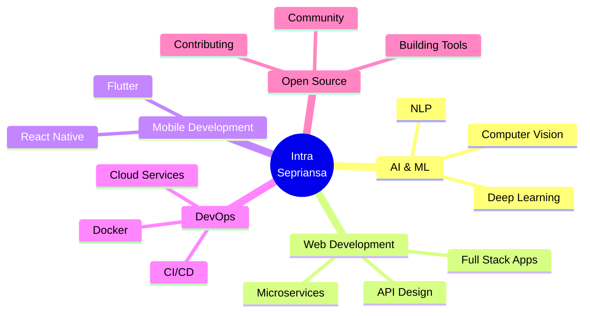
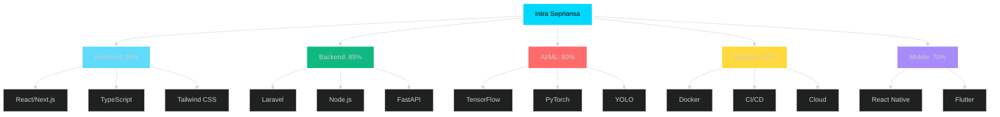

<div align="center">

<!-- Ultra Advanced Animated Header -->


<!-- Matrix Rain Effect -->


<!-- Multi-line Typing Animation with More Effects -->


<br/>

<!-- Animated Badges Row -->


<!-- Profile Views with Animation -->
<br/><br/>


## 🚀 About Me

</div>


```typescript
const intraSepriansa = {
    name: "Intra Sepriansa",
    role: "Full Stack Developer",
    location: "Indonesia 🇮🇩",
    education: "Computer Science Student",
    
    code: ["TypeScript", "JavaScript", "Python", "PHP", "C#"],
    technologies: {
        frontEnd: {
            js: ["React", "Next.js", "Vue.js"],
            css: ["Tailwind", "Bootstrap", "Material-UI"]
        },
        backEnd: {
            js: ["Node.js", "Express"],
            php: ["Laravel"],
            python: ["FastAPI", "Django"]
        },
        databases: ["MySQL", "PostgreSQL", "MongoDB", "Redis"],
        ai_ml: ["TensorFlow", "PyTorch", "YOLO", "OpenCV"],
        devOps: ["Docker", "Git", "GitHub Actions", "Vercel"],
        tools: ["VS Code", "Postman", "Figma", "Jira"]
    },
    
    currentFocus: "Building AI-powered applications",
    funFact: "I debug with console.log() 🐛"
};
```

<br clear="both"/>

---

<div align="center">

## 🛠️ Tech Stack & Tools

</div>

### 💻 Languages

<div align="center">


</div>

### 🎨 Frontend Development

<div align="center">


</div>

### ⚙️ Backend Development

<div align="center">


</div>

### 🗄️ Databases

<div align="center">


</div>

### 🤖 AI & Machine Learning

<div align="center">


</div>

### 🛠️ DevOps & Tools

<div align="center">


</div>

---

<div align="center">

## 📊 GitHub Statistics

</div>

<div align="center">
  
  
</div>

<div align="center">
  
  
</div>

---

<div align="center">

## 🏆 GitHub Trophies

</div>

<div align="center">
  
</div>

---

<div align="center">

## 📈 Contribution Graph

</div>

<div align="center">
  
</div>

---

<div align="center">

## 🐍 Contribution Snake

</div>

<picture>
  <source media="(prefers-color-scheme: dark)" srcset="https://raw.githubusercontent.com/Intra-Sepriansa/Intra-Sepriansa/output/github-contribution-grid-snake-dark.svg">
  <source media="(prefers-color-scheme: light)" srcset="https://raw.githubusercontent.com/Intra-Sepriansa/Intra-Sepriansa/output/github-contribution-grid-snake.svg">
  
</picture>

---

<div align="center">

## 🎯 Current Focus

</div>

<div align="center">



</div>

---

<div align="center">

## 🎨 Featured Projects

</div>

<div align="center">

<a href="https://github.com/Intra-Sepriansa/TPLK004">
  
</a>

<a href="https://github.com/Intra-Sepriansa/your-project-2">
  
</a>

</div>

<br/>

<div align="center">

<a href="https://github.com/Intra-Sepriansa/your-project-3">
  
</a>

<a href="https://github.com/Intra-Sepriansa/your-project-4">
  
</a>

</div>

---

<div align="center">

## 💼 Skills Radar

</div>

<div align="center">



</div>

---

<div align="center">

## 📫 Connect With Me

</div>

<div align="center">

[](https://youtube.com/@intrasepriansa)
[](https://instagram.com/intrasepriansa)
[](https://linkedin.com/in/intrasepriansa)
[](https://twitter.com/intrasepriansa)
[](https://discord.gg/yourdiscord)
[](https://twitch.tv/intrasepriansa)
[](mailto:intrasepriansa@gmail.com)
[](https://intrasepriansa.dev)

</div>

---

<div align="center">

## 💡 Random Dev Quote

</div>

<div align="center">


</div>

---

<div align="center">

## 😂 Random Dev Meme

</div>

<div align="center">


</div>

---

<div align="center">

## 📊 Weekly Development Breakdown

</div>

<!--START_SECTION:waka-->
<!--END_SECTION:waka-->

---

<div align="center">

## 🎵 Spotify Playing

</div>

<div align="center">

[](https://open.spotify.com/user/yourusername)

</div>

---

<div align="center">

## 🌟 Support My Work

</div>

<div align="center">

If you like my work, consider buying me a coffee! ☕

[](https://buymeacoffee.com/intrasepriansa)
[](https://ko-fi.com/intrasepriansa)
[](https://paypal.me/intrasepriansa)

</div>

---

<div align="center">

## 📝 Latest Blog Posts

</div>

<!-- BLOG-POST-LIST:START -->
<!-- BLOG-POST-LIST:END -->

---

<div align="center">

### 💭 Quote of the Day

*"Code is like humor. When you have to explain it, it's bad."* – Cory House

</div>

---

<div align="center">

### 🎯 2024 Goals

- ✅ Master TypeScript & Advanced React Patterns
- ✅ Build 5 Full-Stack Projects
- 🔄 Contribute to 10 Open Source Projects
- 🔄 Learn Rust & WebAssembly
- 📝 Write 20 Technical Blog Posts
- 🎓 Get AWS Certification
- 🚀 Launch a SaaS Product

</div>

---

<div align="center">

### 📈 Profile Stats


</div>

<div align="center">


</div>

<div align="center">


</div>

---

<div align="center">

### 🎨 Contribution Calendar


</div>

---

<div align="center">

### 🏅 Achievements


</div>

---

<div align="center">

### 🌐 Visitor Map


</div>

---

<div align="center">

### 💻 Coding Activity

<!--START_SECTION:activity-->
<!--END_SECTION:activity-->

</div>

---

<div align="center">


### Show some ❤️ by starring some of my repositories!


</div>
