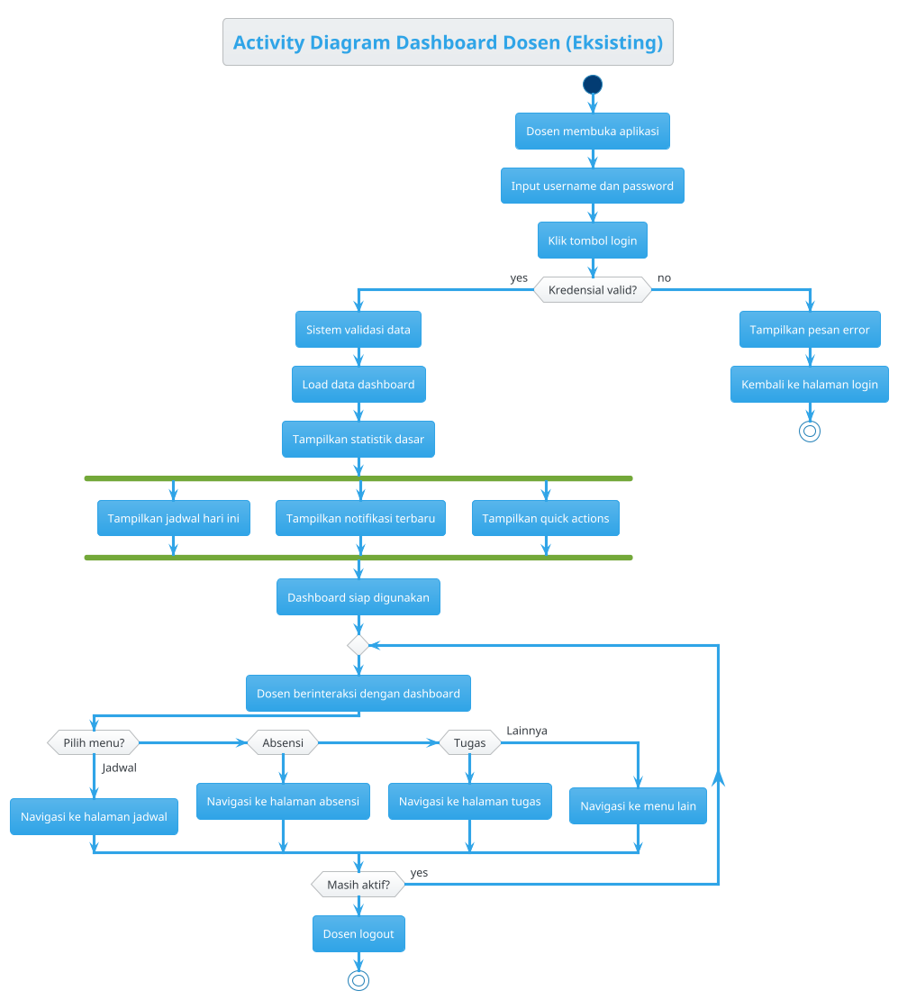
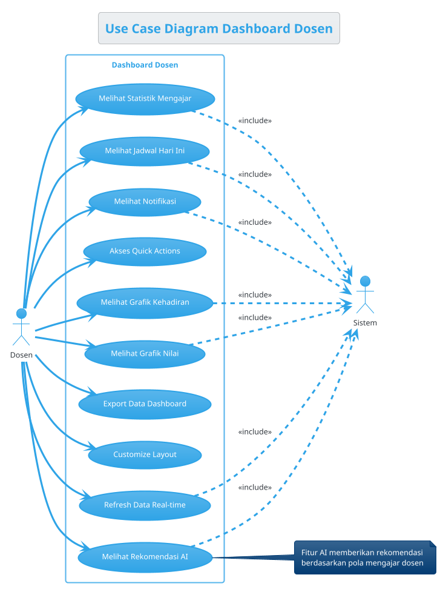
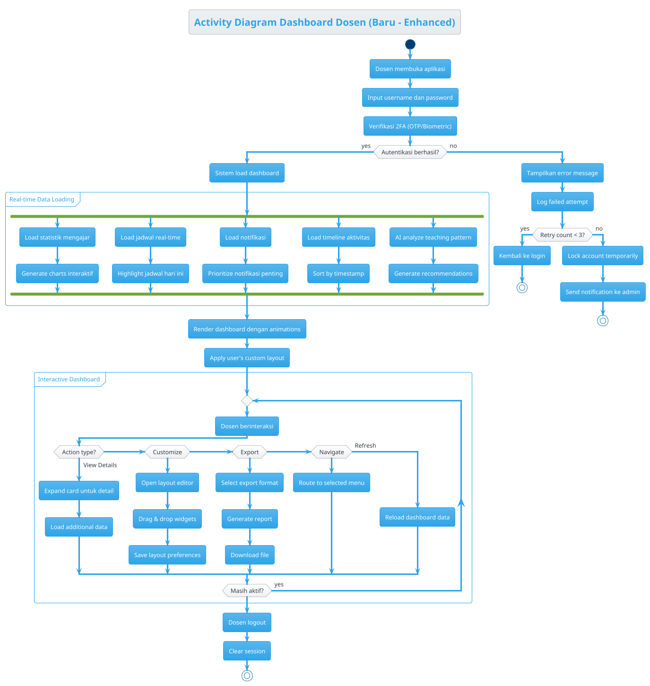
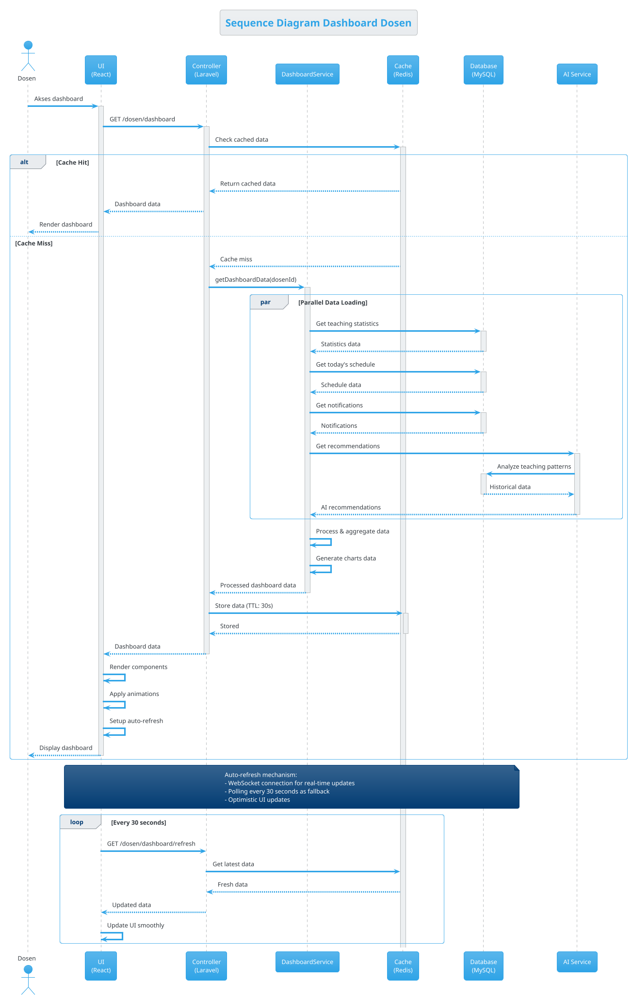
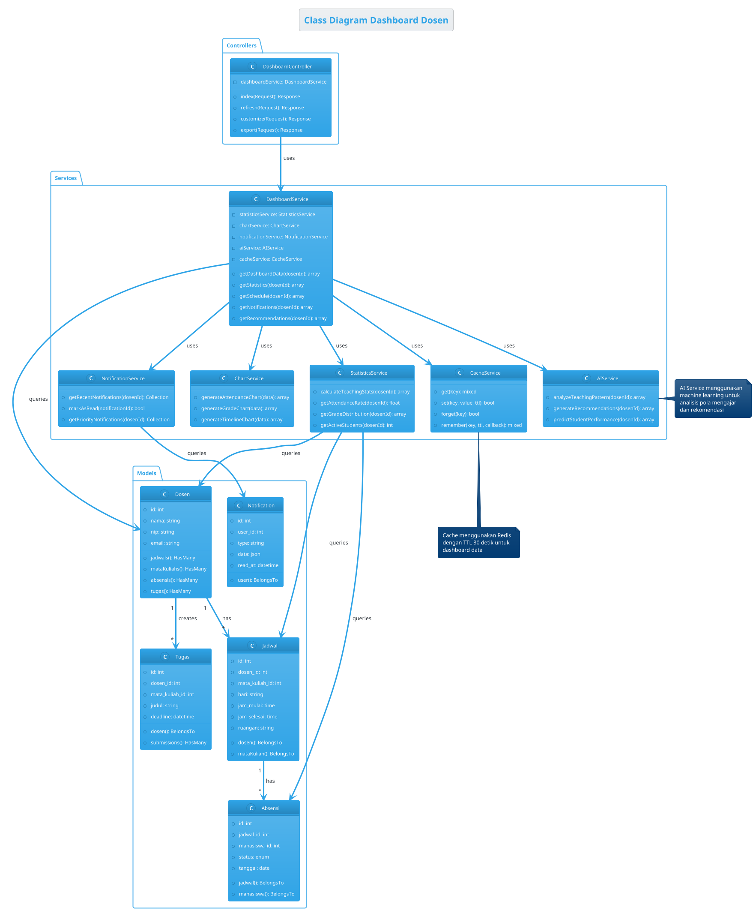
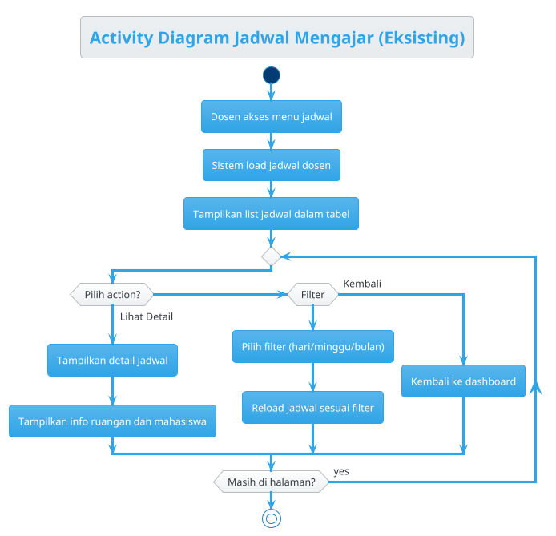
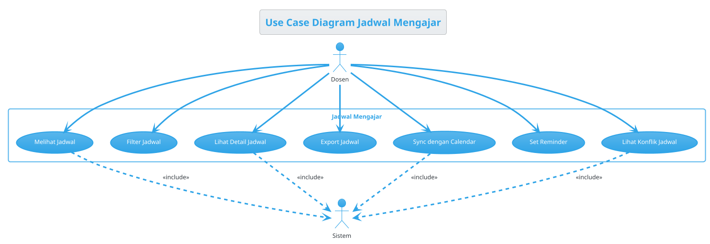
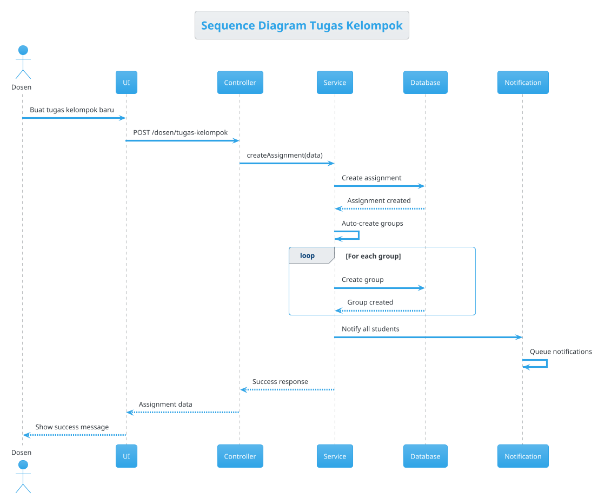

# PROMPT: Dokumentasi UML Dosen - Ultra Advanced Complete

## 🎯 TUJUAN UTAMA
Membuat halaman dokumentasi UML yang sangat advanced dan profesional untuk semua menu di sistem dosen dengan:
1. **5 Jenis Diagram UML** per menu (Activity Diagram Eksisting, Use Case, Activity Diagram, Sequence Diagram, Class Diagram)
2. **UI/UX Ultra Modern** dengan animasi smooth dan interaktif
3. **PlantUML Integration** untuk rendering diagram real-time
4. **Interactive Diagram Viewer** dengan zoom, pan, dan export
5. **Penjelasan Detail** untuk setiap diagram dan menu
6. **Search & Filter** untuk navigasi cepat
7. **Dark Mode Support** dengan syntax highlighting
8. **Export Options** (PNG, SVG, PDF, PlantUML code)
9. **Version History** untuk tracking perubahan diagram
10. **Collaborative Editing** dengan real-time preview

## 📋 DAFTAR MENU DOSEN YANG AKAN DIDOKUMENTASIKAN

### 1. Dashboard Dosen
### 2. Jadwal Mengajar
### 3. Mata Kuliah
### 4. Mahasiswa
### 5. Absensi
### 6. Tugas
### 7. Tugas Kelompok
### 8. Ujian
### 9. Nilai
### 10. Dokumentasi
### 11. Notifikasi
### 12. Pengaturan

## 🎨 UI/UX DESIGN - HALAMAN UTAMA

### 1. Header dengan Navigation
```typescript
// File: resources/js/pages/dosen/dokumentasi-uml.tsx

import { useState, useEffect } from 'react';
import { Head, router } from '@inertiajs/react';
import DosenLayout from '@/layouts/dosen-layout';
import { motion, AnimatePresence } from 'framer-motion';
import {
    FileText, GitBranch, Activity, Users, Box, Download, Search,
    Filter, ZoomIn, ZoomOut, Maximize2, Code, Eye, Edit3, History,
    Share2, BookOpen, ChevronRight, Layers, Network, Workflow
} from 'lucide-react';

interface Menu {
    id: string;
    name: string;
    icon: any;
    color: string;
    description: string;
    diagrams: {
        activity_existing: string;
        use_case: string;
        activity: string;
        sequence: string;
        class: string;
    };
}

export default function DokumentasiUML() {
    const [selectedMenu, setSelectedMenu] = useState<string | null>(null);
    const [selectedDiagram, setSelectedDiagram] = useState<'activity_existing' | 'use_case' | 'activity' | 'sequence' | 'class'>('use_case');
    const [searchQuery, setSearchQuery] = useState('');
    const [viewMode, setViewMode] = useState<'grid' | 'list'>('grid');
    const [zoomLevel, setZoomLevel] = useState(100);
    const [showCode, setShowCode] = useState(false);

    const menus: Menu[] = [
        {
            id: 'dashboard',
            name: 'Dashboard Dosen',
            icon: Layers,
            color: 'from-blue-500 to-cyan-500',
            description: 'Dashboard utama dengan overview statistik dan aktivitas dosen',
            diagrams: { /* PlantUML codes */ },
        },
        {
            id: 'jadwal',
            name: 'Jadwal Mengajar',
            icon: Calendar,
            color: 'from-purple-500 to-pink-500',
            description: 'Manajemen jadwal mengajar dan kalender akademik',
            diagrams: { /* PlantUML codes */ },
        },
        // ... 10 menu lainnya
    ];

    return (
        <DosenLayout>
            <Head title="Dokumentasi UML" />
            
            <motion.div
                initial={{ opacity: 0 }}
                animate={{ opacity: 1 }}
                className="min-h-screen bg-gradient-to-br from-neutral-50 to-neutral-100 dark:from-neutral-900 dark:to-neutral-800 p-6"
            >
                {/* Hero Header */}
                <motion.div
                    initial={{ y: -20, opacity: 0 }}
                    animate={{ y: 0, opacity: 1 }}
                    className="relative overflow-hidden rounded-3xl bg-gradient-to-br from-indigo-600 via-purple-600 to-pink-500 p-8 mb-6 shadow-2xl"
                >
                    <div className="absolute inset-0 bg-gradient-to-br from-white/5 to-transparent" />
                    <div className="absolute -right-20 -top-20 h-64 w-64 rounded-full bg-white/10 blur-3xl" />
                    <div className="absolute -bottom-20 -left-20 h-64 w-64 rounded-full bg-white/10 blur-3xl" />
                    
                    <div className="relative z-10">
                        <div className="flex items-center gap-4 mb-4">
                            <motion.div
                                whileHover={{ rotate: 360, scale: 1.1 }}
                                transition={{ duration: 0.6 }}
                                className="h-16 w-16 rounded-2xl bg-white/20 backdrop-blur-md flex items-center justify-center"
                            >
                                <FileText className="h-8 w-8 text-white" />
                            </motion.div>
                            <div>
                                <h1 className="text-3xl font-bold text-white">
                                    Dokumentasi UML Sistem Dosen
                                </h1>
                                <p className="text-purple-100 mt-1">
                                    Comprehensive UML diagrams untuk semua fitur sistem dosen
                                </p>
                            </div>
                        </div>

                        {/* Stats */}
                        <div className="grid grid-cols-4 gap-4 mt-6">
                            {[
                                { label: 'Total Menu', value: '12', icon: Layers },
                                { label: 'Total Diagram', value: '60', icon: GitBranch },
                                { label: 'Diagram Types', value: '5', icon: Network },
                                { label: 'Last Updated', value: 'Today', icon: Activity },
                            ].map((stat, index) => (
                                <motion.div
                                    key={stat.label}
                                    initial={{ scale: 0, opacity: 0 }}
                                    animate={{ scale: 1, opacity: 1 }}
                                    transition={{ delay: index * 0.1 }}
                                    className="bg-white/10 backdrop-blur-md rounded-2xl p-4 border border-white/20"
                                >
                                    <div className="flex items-center gap-3">
                                        <stat.icon className="h-8 w-8 text-white" />
                                        <div>
                                            <p className="text-2xl font-bold text-white">{stat.value}</p>
                                            <p className="text-xs text-purple-100">{stat.label}</p>
                                        </div>
                                    </div>
                                </motion.div>
                            ))}
                        </div>
                    </div>
                </motion.div>

                {/* Search & Filter Bar */}
                <motion.div
                    initial={{ y: 20, opacity: 0 }}
                    animate={{ y: 0, opacity: 1 }}
                    transition={{ delay: 0.2 }}
                    className="bg-white dark:bg-neutral-800 rounded-2xl p-4 mb-6 shadow-xl"
                >
                    <div className="flex items-center gap-4">
                        <div className="relative flex-1">
                            <Search className="absolute left-3 top-1/2 -translate-y-1/2 h-5 w-5 text-neutral-400" />
                            <input
                                type="text"
                                placeholder="Cari menu atau diagram..."
                                value={searchQuery}
                                onChange={(e) => setSearchQuery(e.target.value)}
                                className="w-full pl-10 pr-4 py-3 rounded-xl border border-neutral-200 dark:border-neutral-700 bg-neutral-50 dark:bg-neutral-900 focus:ring-2 focus:ring-indigo-500 focus:border-transparent"
                            />
                        </div>
                        
                        <div className="flex items-center gap-2">
                            <button
                                onClick={() => setViewMode('grid')}
                                className={`p-3 rounded-xl transition-all ${
                                    viewMode === 'grid'
                                        ? 'bg-indigo-600 text-white'
                                        : 'bg-neutral-100 dark:bg-neutral-700 text-neutral-600 dark:text-neutral-300'
                                }`}
                            >
                                <Layers className="h-5 w-5" />
                            </button>
                            <button
                                onClick={() => setViewMode('list')}
                                className={`p-3 rounded-xl transition-all ${
                                    viewMode === 'list'
                                        ? 'bg-indigo-600 text-white'
                                        : 'bg-neutral-100 dark:bg-neutral-700 text-neutral-600 dark:text-neutral-300'
                                }`}
                            >
                                <FileText className="h-5 w-5" />
                            </button>
                        </div>
                    </div>
                </motion.div>

                {/* Main Content */}
                <div className="grid grid-cols-12 gap-6">
                    {/* Sidebar - Menu List */}
                    <motion.div
                        initial={{ x: -20, opacity: 0 }}
                        animate={{ x: 0, opacity: 1 }}
                        transition={{ delay: 0.3 }}
                        className="col-span-3"
                    >
                        <div className="bg-white dark:bg-neutral-800 rounded-2xl p-4 shadow-xl sticky top-6">
                            <h3 className="text-lg font-bold mb-4 text-neutral-900 dark:text-white">
                                Menu Sistem
                            </h3>
                            <div className="space-y-2">
                                {menus.map((menu, index) => {
                                    const Icon = menu.icon;
                                    return (
                                        <motion.button
                                            key={menu.id}
                                            initial={{ x: -20, opacity: 0 }}
                                            animate={{ x: 0, opacity: 1 }}
                                            transition={{ delay: 0.4 + index * 0.05 }}
                                            whileHover={{ scale: 1.02, x: 5 }}
                                            whileTap={{ scale: 0.98 }}
                                            onClick={() => setSelectedMenu(menu.id)}
                                            className={`w-full flex items-center gap-3 p-3 rounded-xl transition-all ${
                                                selectedMenu === menu.id
                                                    ? `bg-gradient-to-r ${menu.color} text-white shadow-lg`
                                                    : 'bg-neutral-50 dark:bg-neutral-700 text-neutral-700 dark:text-neutral-300 hover:bg-neutral-100 dark:hover:bg-neutral-600'
                                            }`}
                                        >
                                            <Icon className="h-5 w-5" />
                                            <span className="text-sm font-semibold">{menu.name}</span>
                                            {selectedMenu === menu.id && (
                                                <ChevronRight className="h-4 w-4 ml-auto" />
                                            )}
                                        </motion.button>
                                    );
                                })}
                            </div>
                        </div>
                    </motion.div>

                    {/* Main Content Area */}
                    <div className="col-span-9">
                        {selectedMenu ? (
                            <DiagramViewer
                                menu={menus.find(m => m.id === selectedMenu)!}
                                selectedDiagram={selectedDiagram}
                                onDiagramChange={setSelectedDiagram}
                                zoomLevel={zoomLevel}
                                onZoomChange={setZoomLevel}
                                showCode={showCode}
                                onToggleCode={() => setShowCode(!showCode)}
                            />
                        ) : (
                            <EmptyState />
                        )}
                    </div>
                </div>
            </motion.div>
        </DosenLayout>
    );
}
```


### 2. Diagram Viewer Component
```typescript
const DiagramViewer = ({ menu, selectedDiagram, onDiagramChange, zoomLevel, onZoomChange, showCode, onToggleCode }) => {
    const [isFullscreen, setIsFullscreen] = useState(false);
    const [isExporting, setIsExporting] = useState(false);
    const [showHistory, setShowHistory] = useState(false);

    const diagramTypes = [
        {
            id: 'activity_existing',
            name: 'Activity Diagram (Eksisting)',
            icon: Workflow,
            color: 'from-blue-500 to-cyan-500',
            description: 'Diagram aktivitas sistem yang sudah ada sebelumnya',
        },
        {
            id: 'use_case',
            name: 'Use Case Diagram',
            icon: Users,
            color: 'from-purple-500 to-pink-500',
            description: 'Diagram use case menunjukkan interaksi aktor dengan sistem',
        },
        {
            id: 'activity',
            name: 'Activity Diagram (Baru)',
            icon: Activity,
            color: 'from-emerald-500 to-teal-500',
            description: 'Diagram aktivitas sistem yang baru/diperbaharui',
        },
        {
            id: 'sequence',
            name: 'Sequence Diagram',
            icon: GitBranch,
            color: 'from-amber-500 to-orange-500',
            description: 'Diagram sequence menunjukkan urutan interaksi antar objek',
        },
        {
            id: 'class',
            name: 'Class Diagram',
            icon: Box,
            color: 'from-rose-500 to-red-500',
            description: 'Diagram class menunjukkan struktur kelas dan relasi',
        },
    ];

    const currentDiagram = diagramTypes.find(d => d.id === selectedDiagram)!;

    return (
        <motion.div
            initial={{ opacity: 0, y: 20 }}
            animate={{ opacity: 1, y: 0 }}
            className="space-y-6"
        >
            {/* Diagram Type Selector */}
            <div className="bg-white dark:bg-neutral-800 rounded-2xl p-6 shadow-xl">
                <div className="flex items-center justify-between mb-4">
                    <div>
                        <h2 className="text-2xl font-bold text-neutral-900 dark:text-white">
                            {menu.name}
                        </h2>
                        <p className="text-sm text-neutral-500 dark:text-neutral-400 mt-1">
                            {menu.description}
                        </p>
                    </div>
                    
                    {/* Action Buttons */}
                    <div className="flex items-center gap-2">
                        <motion.button
                            whileHover={{ scale: 1.05 }}
                            whileTap={{ scale: 0.95 }}
                            onClick={() => setShowHistory(true)}
                            className="p-2 rounded-xl bg-neutral-100 dark:bg-neutral-700 hover:bg-neutral-200 dark:hover:bg-neutral-600 transition-colors"
                            title="Version History"
                        >
                            <History className="h-5 w-5 text-neutral-600 dark:text-neutral-300" />
                        </motion.button>
                        <motion.button
                            whileHover={{ scale: 1.05 }}
                            whileTap={{ scale: 0.95 }}
                            onClick={() => handleShare()}
                            className="p-2 rounded-xl bg-neutral-100 dark:bg-neutral-700 hover:bg-neutral-200 dark:hover:bg-neutral-600 transition-colors"
                            title="Share"
                        >
                            <Share2 className="h-5 w-5 text-neutral-600 dark:text-neutral-300" />
                        </motion.button>
                        <motion.button
                            whileHover={{ scale: 1.05 }}
                            whileTap={{ scale: 0.95 }}
                            onClick={() => handleExport()}
                            className="p-2 rounded-xl bg-gradient-to-r from-indigo-600 to-purple-600 text-white"
                            title="Export"
                        >
                            <Download className="h-5 w-5" />
                        </motion.button>
                    </div>
                </div>

                {/* Diagram Type Tabs */}
                <div className="flex gap-2 overflow-x-auto pb-2">
                    {diagramTypes.map((type) => {
                        const Icon = type.icon;
                        return (
                            <motion.button
                                key={type.id}
                                whileHover={{ scale: 1.02 }}
                                whileTap={{ scale: 0.98 }}
                                onClick={() => onDiagramChange(type.id as any)}
                                className={`flex items-center gap-2 px-4 py-3 rounded-xl whitespace-nowrap transition-all ${
                                    selectedDiagram === type.id
                                        ? `bg-gradient-to-r ${type.color} text-white shadow-lg`
                                        : 'bg-neutral-100 dark:bg-neutral-700 text-neutral-700 dark:text-neutral-300 hover:bg-neutral-200 dark:hover:bg-neutral-600'
                                }`}
                            >
                                <Icon className="h-5 w-5" />
                                <span className="font-semibold text-sm">{type.name}</span>
                            </motion.button>
                        );
                    })}
                </div>
            </div>

            {/* Diagram Display Area */}
            <div className="bg-white dark:bg-neutral-800 rounded-2xl shadow-xl overflow-hidden">
                {/* Toolbar */}
                <div className="flex items-center justify-between p-4 border-b border-neutral-200 dark:border-neutral-700">
                    <div className="flex items-center gap-2">
                        <motion.button
                            whileHover={{ scale: 1.1 }}
                            whileTap={{ scale: 0.9 }}
                            onClick={() => onZoomChange(Math.max(50, zoomLevel - 10))}
                            className="p-2 rounded-lg bg-neutral-100 dark:bg-neutral-700 hover:bg-neutral-200 dark:hover:bg-neutral-600"
                        >
                            <ZoomOut className="h-4 w-4" />
                        </motion.button>
                        <span className="text-sm font-semibold text-neutral-700 dark:text-neutral-300 min-w-[60px] text-center">
                            {zoomLevel}%
                        </span>
                        <motion.button
                            whileHover={{ scale: 1.1 }}
                            whileTap={{ scale: 0.9 }}
                            onClick={() => onZoomChange(Math.min(200, zoomLevel + 10))}
                            className="p-2 rounded-lg bg-neutral-100 dark:bg-neutral-700 hover:bg-neutral-200 dark:hover:bg-neutral-600"
                        >
                            <ZoomIn className="h-4 w-4" />
                        </motion.button>
                        <button
                            onClick={() => onZoomChange(100)}
                            className="px-3 py-1 text-xs font-semibold rounded-lg bg-neutral-100 dark:bg-neutral-700 hover:bg-neutral-200 dark:hover:bg-neutral-600"
                        >
                            Reset
                        </button>
                    </div>

                    <div className="flex items-center gap-2">
                        <motion.button
                            whileHover={{ scale: 1.05 }}
                            whileTap={{ scale: 0.95 }}
                            onClick={onToggleCode}
                            className={`flex items-center gap-2 px-4 py-2 rounded-lg font-semibold text-sm transition-all ${
                                showCode
                                    ? 'bg-indigo-600 text-white'
                                    : 'bg-neutral-100 dark:bg-neutral-700 text-neutral-700 dark:text-neutral-300'
                            }`}
                        >
                            <Code className="h-4 w-4" />
                            {showCode ? 'Hide Code' : 'Show Code'}
                        </motion.button>
                        <motion.button
                            whileHover={{ scale: 1.05 }}
                            whileTap={{ scale: 0.95 }}
                            onClick={() => setIsFullscreen(!isFullscreen)}
                            className="p-2 rounded-lg bg-neutral-100 dark:bg-neutral-700 hover:bg-neutral-200 dark:hover:bg-neutral-600"
                        >
                            <Maximize2 className="h-4 w-4" />
                        </motion.button>
                    </div>
                </div>

                {/* Diagram Content */}
                <div className="grid grid-cols-12 gap-0">
                    {/* Diagram Viewer */}
                    <div className={showCode ? 'col-span-7' : 'col-span-12'}>
                        <div className="p-6 bg-neutral-50 dark:bg-neutral-900 min-h-[600px] flex items-center justify-center">
                            <motion.div
                                initial={{ scale: 0.9, opacity: 0 }}
                                animate={{ scale: zoomLevel / 100, opacity: 1 }}
                                transition={{ duration: 0.3 }}
                                className="bg-white dark:bg-neutral-800 rounded-xl shadow-2xl p-8"
                            >
                                <PlantUMLRenderer
                                    code={menu.diagrams[selectedDiagram]}
                                    type={selectedDiagram}
                                />
                            </motion.div>
                        </div>
                    </div>

                    {/* Code Panel */}
                    <AnimatePresence>
                        {showCode && (
                            <motion.div
                                initial={{ x: 100, opacity: 0 }}
                                animate={{ x: 0, opacity: 1 }}
                                exit={{ x: 100, opacity: 0 }}
                                className="col-span-5 border-l border-neutral-200 dark:border-neutral-700"
                            >
                                <div className="p-4 bg-neutral-100 dark:bg-neutral-800 h-full">
                                    <div className="flex items-center justify-between mb-3">
                                        <h3 className="text-sm font-bold text-neutral-900 dark:text-white">
                                            PlantUML Code
                                        </h3>
                                        <button
                                            onClick={() => handleCopyCode(menu.diagrams[selectedDiagram])}
                                            className="px-3 py-1 text-xs font-semibold rounded-lg bg-indigo-600 text-white hover:bg-indigo-700"
                                        >
                                            Copy
                                        </button>
                                    </div>
                                    <pre className="bg-neutral-900 text-green-400 p-4 rounded-xl overflow-auto h-[calc(100%-40px)] text-xs font-mono">
                                        <code>{menu.diagrams[selectedDiagram]}</code>
                                    </pre>
                                </div>
                            </motion.div>
                        )}
                    </AnimatePresence>
                </div>

                {/* Diagram Description */}
                <div className="p-6 border-t border-neutral-200 dark:border-neutral-700 bg-gradient-to-br from-indigo-50 to-purple-50 dark:from-indigo-900/20 dark:to-purple-900/20">
                    <div className="flex items-start gap-4">
                        <div className={`h-12 w-12 rounded-xl bg-gradient-to-br ${currentDiagram.color} flex items-center justify-center text-white shrink-0`}>
                            <currentDiagram.icon className="h-6 w-6" />
                        </div>
                        <div className="flex-1">
                            <h3 className="text-lg font-bold text-neutral-900 dark:text-white mb-2">
                                {currentDiagram.name}
                            </h3>
                            <p className="text-sm text-neutral-600 dark:text-neutral-400 mb-4">
                                {currentDiagram.description}
                            </p>
                            <DiagramExplanation
                                menuId={menu.id}
                                diagramType={selectedDiagram}
                            />
                        </div>
                    </div>
                </div>
            </div>
        </motion.div>
    );
};
```

### 3. PlantUML Renderer Component
```typescript
const PlantUMLRenderer = ({ code, type }) => {
    const [imageUrl, setImageUrl] = useState('');
    const [isLoading, setIsLoading] = useState(true);
    const [error, setError] = useState(null);

    useEffect(() => {
        renderPlantUML();
    }, [code]);

    const renderPlantUML = async () => {
        setIsLoading(true);
        setError(null);

        try {
            // Encode PlantUML code
            const encoded = encodePlantUML(code);
            
            // Use PlantUML server to render
            const url = `https://www.plantuml.com/plantuml/svg/${encoded}`;
            
            setImageUrl(url);
        } catch (err) {
            setError(err.message);
        } finally {
            setIsLoading(false);
        }
    };

    const encodePlantUML = (text: string): string => {
        // PlantUML encoding algorithm
        const compressed = pako.deflate(text, { level: 9 });
        return encode64(compressed);
    };

    if (isLoading) {
        return (
            <div className="flex items-center justify-center h-96">
                <motion.div
                    animate={{ rotate: 360 }}
                    transition={{ duration: 1, repeat: Infinity, ease: 'linear' }}
                    className="h-12 w-12 border-4 border-indigo-600 border-t-transparent rounded-full"
                />
            </div>
        );
    }

    if (error) {
        return (
            <div className="flex flex-col items-center justify-center h-96 text-red-600">
                <AlertTriangle className="h-12 w-12 mb-4" />
                <p className="font-semibold">Error rendering diagram</p>
                <p className="text-sm">{error}</p>
            </div>
        );
    }

    return (
        <motion.img
            initial={{ opacity: 0, scale: 0.95 }}
            animate={{ opacity: 1, scale: 1 }}
            src={imageUrl}
            alt={`${type} diagram`}
            className="max-w-full h-auto"
            onError={() => setError('Failed to load diagram')}
        />
    );
};
```

### 4. Diagram Explanation Component
```typescript
const DiagramExplanation = ({ menuId, diagramType }) => {
    const explanations = {
        dashboard: {
            activity_existing: {
                title: 'Alur Aktivitas Dashboard Eksisting',
                points: [
                    'Dosen login ke sistem',
                    'Sistem menampilkan dashboard dengan statistik dasar',
                    'Dosen dapat melihat jadwal hari ini',
                    'Dosen dapat melihat notifikasi terbaru',
                    'Sistem menampilkan quick actions',
                ],
                details: 'Diagram ini menunjukkan alur aktivitas dashboard yang sudah ada sebelumnya, dengan fokus pada tampilan informasi dasar dan navigasi sederhana.',
            },
            use_case: {
                title: 'Use Case Dashboard Dosen',
                actors: ['Dosen', 'Sistem'],
                useCases: [
                    'Melihat Statistik Mengajar',
                    'Melihat Jadwal Hari Ini',
                    'Melihat Notifikasi',
                    'Akses Quick Actions',
                    'Melihat Grafik Kehadiran',
                    'Melihat Grafik Nilai',
                    'Export Data Dashboard',
                ],
                details: 'Use case diagram menunjukkan semua interaksi yang dapat dilakukan dosen pada dashboard, termasuk fitur-fitur baru yang ditambahkan.',
            },
            activity: {
                title: 'Alur Aktivitas Dashboard Baru',
                points: [
                    'Dosen login dengan autentikasi 2FA',
                    'Sistem load dashboard dengan real-time data',
                    'Menampilkan statistik advanced dengan charts interaktif',
                    'Menampilkan timeline aktivitas terkini',
                    'Menampilkan rekomendasi AI untuk dosen',
                    'Dosen dapat customize layout dashboard',
                    'Sistem auto-refresh data setiap 30 detik',
                ],
                details: 'Diagram aktivitas baru menunjukkan peningkatan fitur dengan real-time updates, AI recommendations, dan customizable layout.',
            },
            sequence: {
                title: 'Sequence Diagram Dashboard',
                participants: ['Dosen', 'UI', 'Controller', 'Service', 'Database', 'Cache'],
                flows: [
                    'Dosen request dashboard',
                    'UI kirim request ke Controller',
                    'Controller cek cache',
                    'Jika cache miss, query Database',
                    'Service process data dan generate statistics',
                    'Service store ke Cache',
                    'Controller return data ke UI',
                    'UI render dashboard dengan animations',
                ],
                details: 'Sequence diagram menunjukkan alur komunikasi antar komponen sistem saat loading dashboard, termasuk caching strategy.',
            },
            class: {
                title: 'Class Diagram Dashboard',
                classes: [
                    'DashboardController',
                    'DashboardService',
                    'StatisticsService',
                    'ChartService',
                    'NotificationService',
                    'CacheService',
                    'Dosen (Model)',
                    'Jadwal (Model)',
                    'Absensi (Model)',
                ],
                relationships: [
                    'DashboardController uses DashboardService',
                    'DashboardService uses StatisticsService',
                    'DashboardService uses ChartService',
                    'DashboardService uses NotificationService',
                    'All services use CacheService',
                ],
                details: 'Class diagram menunjukkan struktur kelas dan relasi antar komponen dalam modul dashboard.',
            },
        },
        // ... explanations untuk 11 menu lainnya
    };

    const explanation = explanations[menuId]?.[diagramType];

    if (!explanation) return null;

    return (
        <motion.div
            initial={{ opacity: 0, y: 10 }}
            animate={{ opacity: 1, y: 0 }}
            className="space-y-4"
        >
            <div className="bg-white dark:bg-neutral-800 rounded-xl p-4 border border-neutral-200 dark:border-neutral-700">
                <h4 className="font-bold text-neutral-900 dark:text-white mb-3">
                    📋 {explanation.title}
                </h4>
                
                {explanation.points && (
                    <ul className="space-y-2">
                        {explanation.points.map((point, index) => (
                            <motion.li
                                key={index}
                                initial={{ opacity: 0, x: -10 }}
                                animate={{ opacity: 1, x: 0 }}
                                transition={{ delay: index * 0.1 }}
                                className="flex items-start gap-2 text-sm text-neutral-600 dark:text-neutral-400"
                            >
                                <span className="h-6 w-6 rounded-full bg-indigo-100 dark:bg-indigo-900 text-indigo-600 dark:text-indigo-400 flex items-center justify-center text-xs font-bold shrink-0">
                                    {index + 1}
                                </span>
                                {point}
                            </motion.li>
                        ))}
                    </ul>
                )}

                {explanation.actors && (
                    <div className="mt-4">
                        <p className="text-sm font-semibold text-neutral-700 dark:text-neutral-300 mb-2">
                            Actors:
                        </p>
                        <div className="flex gap-2">
                            {explanation.actors.map((actor, index) => (
                                <span
                                    key={index}
                                    className="px-3 py-1 rounded-full bg-purple-100 dark:bg-purple-900 text-purple-700 dark:text-purple-300 text-xs font-semibold"
                                >
                                    {actor}
                                </span>
                            ))}
                        </div>
                    </div>
                )}

                {explanation.useCases && (
                    <div className="mt-4">
                        <p className="text-sm font-semibold text-neutral-700 dark:text-neutral-300 mb-2">
                            Use Cases:
                        </p>
                        <div className="grid grid-cols-2 gap-2">
                            {explanation.useCases.map((useCase, index) => (
                                <div
                                    key={index}
                                    className="flex items-center gap-2 text-xs text-neutral-600 dark:text-neutral-400"
                                >
                                    <div className="h-2 w-2 rounded-full bg-indigo-600" />
                                    {useCase}
                                </div>
                            ))}
                        </div>
                    </div>
                )}

                <p className="mt-4 text-sm text-neutral-600 dark:text-neutral-400 italic">
                    {explanation.details}
                </p>
            </div>
        </motion.div>
    );
};
```


## 📐 PLANTUML CODE - CONTOH LENGKAP

### 1. Dashboard Dosen - Activity Diagram Eksisting


### 2. Dashboard Dosen - Use Case Diagram


### 3. Dashboard Dosen - Activity Diagram Baru


### 4. Dashboard Dosen - Sequence Diagram


### 5. Dashboard Dosen - Class Diagram



## 📐 PLANTUML CODE - MENU LAINNYA (TEMPLATE)

### Menu 2: Jadwal Mengajar

#### Activity Diagram Eksisting


#### Use Case Diagram


### Menu 3: Tugas Kelompok

#### Sequence Diagram


## 🎨 FITUR ADVANCED TAMBAHAN

### 1. Export Diagram Component
```typescript
const ExportDiagramModal = ({ diagram, menuName, diagramType }) => {
    const [exportFormat, setExportFormat] = useState<'png' | 'svg' | 'pdf' | 'plantuml'>('png');
    const [exportQuality, setExportQuality] = useState<'low' | 'medium' | 'high'>('high');
    const [includeWatermark, setIncludeWatermark] = useState(false);

    const handleExport = async () => {
        const response = await axios.post('/dosen/dokumentasi-uml/export', {
            menu: menuName,
            diagram_type: diagramType,
            format: exportFormat,
            quality: exportQuality,
            watermark: includeWatermark,
        }, {
            responseType: 'blob'
        });

        // Download file
        const url = window.URL.createObjectURL(new Blob([response.data]));
        const link = document.createElement('a');
        link.href = url;
        link.setAttribute('download', `${menuName}_${diagramType}.${exportFormat}`);
        document.body.appendChild(link);
        link.click();
        link.remove();
    };

    return (
        <Dialog open onOpenChange={onClose}>
            <DialogContent className="max-w-md">
                <DialogHeader>
                    <DialogTitle>Export Diagram</DialogTitle>
                    <DialogDescription>
                        Pilih format dan kualitas export
                    </DialogDescription>
                </DialogHeader>

                <div className="space-y-4">
                    <div>
                        <label className="text-sm font-bold mb-2 block">Format</label>
                        <div className="grid grid-cols-2 gap-2">
                            {['png', 'svg', 'pdf', 'plantuml'].map(format => (
                                <button
                                    key={format}
                                    onClick={() => setExportFormat(format as any)}
                                    className={`p-3 rounded-xl border-2 transition-all ${
                                        exportFormat === format
                                            ? 'border-indigo-600 bg-indigo-50 dark:bg-indigo-900/20'
                                            : 'border-neutral-200 dark:border-neutral-700'
                                    }`}
                                >
                                    <p className="font-bold text-sm uppercase">{format}</p>
                                </button>
                            ))}
                        </div>
                    </div>

                    {exportFormat !== 'plantuml' && (
                        <div>
                            <label className="text-sm font-bold mb-2 block">Quality</label>
                            <select
                                value={exportQuality}
                                onChange={(e) => setExportQuality(e.target.value as any)}
                                className="w-full rounded-lg border px-3 py-2"
                            >
                                <option value="low">Low (Fast)</option>
                                <option value="medium">Medium</option>
                                <option value="high">High (Best Quality)</option>
                            </select>
                        </div>
                    )}

                    <label className="flex items-center gap-2 cursor-pointer">
                        <input
                            type="checkbox"
                            checked={includeWatermark}
                            onChange={(e) => setIncludeWatermark(e.target.checked)}
                        />
                        <span className="text-sm">Include watermark</span>
                    </label>
                </div>

                <DialogFooter>
                    <Button onClick={handleExport} className="bg-gradient-to-r from-indigo-600 to-purple-600">
                        <Download className="h-4 w-4 mr-2" />
                        Export
                    </Button>
                </DialogFooter>
            </DialogContent>
        </Dialog>
    );
};
```

### 2. Version History Component
```typescript
const VersionHistoryModal = ({ menuId, diagramType }) => {
    const [versions, setVersions] = useState([]);
    const [selectedVersion, setSelectedVersion] = useState(null);
    const [compareMode, setCompareMode] = useState(false);

    useEffect(() => {
        loadVersionHistory();
    }, []);

    const loadVersionHistory = async () => {
        const response = await axios.get(`/dosen/dokumentasi-uml/history`, {
            params: { menu: menuId, diagram_type: diagramType }
        });
        setVersions(response.data);
    };

    const handleRestore = async (versionId) => {
        if (!confirm('Restore diagram ke versi ini?')) return;

        await axios.post(`/dosen/dokumentasi-uml/restore`, {
            version_id: versionId
        });

        toast.success('Diagram berhasil di-restore!');
        onClose();
    };

    return (
        <Dialog open onOpenChange={onClose}>
            <DialogContent className="max-w-4xl h-[80vh]">
                <DialogHeader>
                    <DialogTitle>Version History</DialogTitle>
                    <DialogDescription>
                        Riwayat perubahan diagram
                    </DialogDescription>
                </DialogHeader>

                <div className="flex-1 overflow-y-auto">
                    <div className="space-y-3">
                        {versions.map((version, index) => (
                            <motion.div
                                key={version.id}
                                initial={{ opacity: 0, x: -20 }}
                                animate={{ opacity: 1, x: 0 }}
                                transition={{ delay: index * 0.05 }}
                                className="flex items-start gap-4 p-4 rounded-xl border border-neutral-200 dark:border-neutral-700 hover:bg-neutral-50 dark:hover:bg-neutral-800 cursor-pointer"
                                onClick={() => setSelectedVersion(version)}
                            >
                                <div className="h-10 w-10 rounded-full bg-gradient-to-br from-indigo-500 to-purple-500 flex items-center justify-center text-white font-bold shrink-0">
                                    v{version.version}
                                </div>
                                <div className="flex-1">
                                    <div className="flex items-center justify-between mb-1">
                                        <p className="font-bold text-neutral-900 dark:text-white">
                                            Version {version.version}
                                        </p>
                                        <span className="text-xs text-neutral-500">
                                            {version.created_at}
                                        </span>
                                    </div>
                                    <p className="text-sm text-neutral-600 dark:text-neutral-400">
                                        {version.description || 'No description'}
                                    </p>
                                    <p className="text-xs text-neutral-500 mt-1">
                                        By {version.user.nama}
                                    </p>
                                </div>
                                <div className="flex items-center gap-2">
                                    <Button
                                        size="sm"
                                        variant="outline"
                                        onClick={(e) => {
                                            e.stopPropagation();
                                            handleRestore(version.id);
                                        }}
                                    >
                                        <History className="h-4 w-4 mr-1" />
                                        Restore
                                    </Button>
                                </div>
                            </motion.div>
                        ))}
                    </div>
                </div>
            </DialogContent>
        </Dialog>
    );
};
```

### 3. Collaborative Editing Component
```typescript
const CollaborativeEditor = ({ menuId, diagramType }) => {
    const [code, setCode] = useState('');
    const [activeUsers, setActiveUsers] = useState([]);
    const [isConnected, setIsConnected] = useState(false);

    useEffect(() => {
        // Connect to WebSocket for real-time collaboration
        const channel = Echo.join(`diagram.${menuId}.${diagramType}`)
            .here((users) => {
                setActiveUsers(users);
                setIsConnected(true);
            })
            .joining((user) => {
                setActiveUsers(prev => [...prev, user]);
                toast.info(`${user.nama} joined the editing session`);
            })
            .leaving((user) => {
                setActiveUsers(prev => prev.filter(u => u.id !== user.id));
                toast.info(`${user.nama} left the editing session`);
            })
            .listen('DiagramUpdated', (e) => {
                setCode(e.code);
            });

        return () => channel.leave();
    }, []);

    const handleCodeChange = (newCode) => {
        setCode(newCode);
        
        // Debounce and broadcast changes
        debouncedBroadcast(newCode);
    };

    const debouncedBroadcast = debounce((newCode) => {
        axios.post(`/dosen/dokumentasi-uml/update`, {
            menu: menuId,
            diagram_type: diagramType,
            code: newCode,
        });
    }, 1000);

    return (
        <div className="space-y-4">
            {/* Active Users */}
            <div className="flex items-center gap-2">
                <div className="flex items-center gap-1">
                    {activeUsers.slice(0, 5).map((user, index) => (
                        <motion.div
                            key={user.id}
                            initial={{ scale: 0 }}
                            animate={{ scale: 1 }}
                            transition={{ delay: index * 0.1 }}
                            className="h-8 w-8 rounded-full bg-gradient-to-br from-indigo-400 to-purple-600 flex items-center justify-center text-white text-xs font-bold border-2 border-white dark:border-neutral-900"
                            title={user.nama}
                            style={{ marginLeft: index > 0 ? '-8px' : '0' }}
                        >
                            {user.nama.charAt(0)}
                        </motion.div>
                    ))}
                    {activeUsers.length > 5 && (
                        <div className="h-8 w-8 rounded-full bg-neutral-200 dark:bg-neutral-700 flex items-center justify-center text-xs font-bold border-2 border-white dark:border-neutral-900" style={{ marginLeft: '-8px' }}>
                            +{activeUsers.length - 5}
                        </div>
                    )}
                </div>
                <span className="text-sm text-neutral-500">
                    {activeUsers.length} {activeUsers.length === 1 ? 'user' : 'users'} editing
                </span>
                {isConnected && (
                    <div className="flex items-center gap-1 text-green-600">
                        <div className="h-2 w-2 rounded-full bg-green-600 animate-pulse" />
                        <span className="text-xs font-semibold">Connected</span>
                    </div>
                )}
            </div>

            {/* Code Editor */}
            <CodeMirror
                value={code}
                onChange={handleCodeChange}
                theme="dark"
                extensions={[plantuml()]}
                className="rounded-xl overflow-hidden"
            />
        </div>
    );
};
```

### 4. Diagram Comparison Component
```typescript
const DiagramComparisonModal = ({ menuId }) => {
    const [leftDiagram, setLeftDiagram] = useState('activity_existing');
    const [rightDiagram, setRightDiagram] = useState('activity');

    return (
        <Dialog open onOpenChange={onClose}>
            <DialogContent className="max-w-7xl h-[90vh]">
                <DialogHeader>
                    <DialogTitle>Compare Diagrams</DialogTitle>
                    <DialogDescription>
                        Bandingkan dua diagram secara side-by-side
                    </DialogDescription>
                </DialogHeader>

                <div className="grid grid-cols-2 gap-4 h-full">
                    {/* Left Panel */}
                    <div className="space-y-4">
                        <select
                            value={leftDiagram}
                            onChange={(e) => setLeftDiagram(e.target.value)}
                            className="w-full rounded-lg border px-3 py-2"
                        >
                            <option value="activity_existing">Activity (Eksisting)</option>
                            <option value="use_case">Use Case</option>
                            <option value="activity">Activity (Baru)</option>
                            <option value="sequence">Sequence</option>
                            <option value="class">Class</option>
                        </select>
                        <div className="bg-neutral-100 dark:bg-neutral-800 rounded-xl p-4 h-[calc(100%-60px)] overflow-auto">
                            <PlantUMLRenderer code={diagrams[leftDiagram]} />
                        </div>
                    </div>

                    {/* Right Panel */}
                    <div className="space-y-4">
                        <select
                            value={rightDiagram}
                            onChange={(e) => setRightDiagram(e.target.value)}
                            className="w-full rounded-lg border px-3 py-2"
                        >
                            <option value="activity_existing">Activity (Eksisting)</option>
                            <option value="use_case">Use Case</option>
                            <option value="activity">Activity (Baru)</option>
                            <option value="sequence">Sequence</option>
                            <option value="class">Class</option>
                        </select>
                        <div className="bg-neutral-100 dark:bg-neutral-800 rounded-xl p-4 h-[calc(100%-60px)] overflow-auto">
                            <PlantUMLRenderer code={diagrams[rightDiagram]} />
                        </div>
                    </div>
                </div>
            </DialogContent>
        </Dialog>
    );
};
```


## 🔧 BACKEND IMPLEMENTATION

### 1. Controller
```php
// File: app/Http/Controllers/Dosen/DokumentasiUMLController.php

namespace App\Http\Controllers\Dosen;

use App\Http\Controllers\Controller;
use App\Models\DiagramVersion;
use Illuminate\Http\Request;
use Inertia\Inertia;
use Illuminate\Support\Facades\Storage;

class DokumentasiUMLController extends Controller
{
    public function index()
    {
        $menus = $this->getAllMenus();
        
        return Inertia::render('dosen/dokumentasi-uml', [
            'menus' => $menus,
        ]);
    }

    public function exportDiagram(Request $request)
    {
        $validated = $request->validate([
            'menu' => 'required|string',
            'diagram_type' => 'required|string',
            'format' => 'required|in:png,svg,pdf,plantuml',
            'quality' => 'required|in:low,medium,high',
            'watermark' => 'boolean',
        ]);

        $diagram = $this->getDiagramCode($validated['menu'], $validated['diagram_type']);

        switch ($validated['format']) {
            case 'png':
                return $this->exportAsPNG($diagram, $validated);
            case 'svg':
                return $this->exportAsSVG($diagram, $validated);
            case 'pdf':
                return $this->exportAsPDF($diagram, $validated);
            case 'plantuml':
                return $this->exportAsPlantUML($diagram, $validated);
        }
    }

    private function exportAsPNG($diagram, $options)
    {
        // Use PlantUML server to generate PNG
        $encoded = $this->encodePlantUML($diagram);
        $url = "https://www.plantuml.com/plantuml/png/{$encoded}";
        
        $image = file_get_contents($url);
        
        // Add watermark if requested
        if ($options['watermark']) {
            $image = $this->addWatermark($image);
        }
        
        $filename = "{$options['menu']}_{$options['diagram_type']}.png";
        
        return response($image)
            ->header('Content-Type', 'image/png')
            ->header('Content-Disposition', "attachment; filename=\"{$filename}\"");
    }

    private function exportAsSVG($diagram, $options)
    {
        $encoded = $this->encodePlantUML($diagram);
        $url = "https://www.plantuml.com/plantuml/svg/{$encoded}";
        
        $svg = file_get_contents($url);
        
        $filename = "{$options['menu']}_{$options['diagram_type']}.svg";
        
        return response($svg)
            ->header('Content-Type', 'image/svg+xml')
            ->header('Content-Disposition', "attachment; filename=\"{$filename}\"");
    }

    private function exportAsPDF($diagram, $options)
    {
        // Generate PNG first
        $encoded = $this->encodePlantUML($diagram);
        $url = "https://www.plantuml.com/plantuml/png/{$encoded}";
        $image = file_get_contents($url);
        
        // Create PDF with image
        $pdf = \PDF::loadView('pdf.diagram', [
            'image' => base64_encode($image),
            'menu' => $options['menu'],
            'diagram_type' => $options['diagram_type'],
            'watermark' => $options['watermark'],
        ]);
        
        $filename = "{$options['menu']}_{$options['diagram_type']}.pdf";
        
        return $pdf->download($filename);
    }

    private function exportAsPlantUML($diagram, $options)
    {
        $filename = "{$options['menu']}_{$options['diagram_type']}.puml";
        
        return response($diagram)
            ->header('Content-Type', 'text/plain')
            ->header('Content-Disposition', "attachment; filename=\"{$filename}\"");
    }

    public function getVersionHistory(Request $request)
    {
        $validated = $request->validate([
            'menu' => 'required|string',
            'diagram_type' => 'required|string',
        ]);

        $versions = DiagramVersion::where('menu', $validated['menu'])
            ->where('diagram_type', $validated['diagram_type'])
            ->with('user')
            ->orderByDesc('created_at')
            ->get()
            ->map(function ($version) {
                return [
                    'id' => $version->id,
                    'version' => $version->version,
                    'description' => $version->description,
                    'code' => $version->code,
                    'created_at' => $version->created_at->diffForHumans(),
                    'user' => [
                        'id' => $version->user->id,
                        'nama' => $version->user->nama,
                    ],
                ];
            });

        return response()->json($versions);
    }

    public function restoreVersion(Request $request)
    {
        $validated = $request->validate([
            'version_id' => 'required|exists:diagram_versions,id',
        ]);

        $version = DiagramVersion::findOrFail($validated['version_id']);
        
        // Create new version from restored code
        DiagramVersion::create([
            'menu' => $version->menu,
            'diagram_type' => $version->diagram_type,
            'code' => $version->code,
            'description' => "Restored from version {$version->version}",
            'user_id' => auth()->id(),
            'version' => $this->getNextVersion($version->menu, $version->diagram_type),
        ]);

        return response()->json(['message' => 'Version restored successfully']);
    }

    public function updateDiagram(Request $request)
    {
        $validated = $request->validate([
            'menu' => 'required|string',
            'diagram_type' => 'required|string',
            'code' => 'required|string',
        ]);

        // Save new version
        $version = DiagramVersion::create([
            'menu' => $validated['menu'],
            'diagram_type' => $validated['diagram_type'],
            'code' => $validated['code'],
            'user_id' => auth()->id(),
            'version' => $this->getNextVersion($validated['menu'], $validated['diagram_type']),
        ]);

        // Broadcast to other users
        broadcast(new DiagramUpdated($validated['menu'], $validated['diagram_type'], $validated['code']));

        return response()->json(['message' => 'Diagram updated successfully', 'version' => $version]);
    }

    private function encodePlantUML($text)
    {
        $compressed = gzdeflate($text, 9);
        return $this->encode64($compressed);
    }

    private function encode64($data)
    {
        $len = strlen($data);
        $result = '';
        
        for ($i = 0; $i < $len; $i += 3) {
            if ($i + 2 == $len) {
                $result .= $this->append3bytes($data[$i], $data[$i + 1], 0);
            } elseif ($i + 1 == $len) {
                $result .= $this->append3bytes($data[$i], 0, 0);
            } else {
                $result .= $this->append3bytes($data[$i], $data[$i + 1], $data[$i + 2]);
            }
        }
        
        return $result;
    }

    private function append3bytes($b1, $b2, $b3)
    {
        $c1 = $b1 >> 2;
        $c2 = (($b1 & 0x3) << 4) | ($b2 >> 4);
        $c3 = (($b2 & 0xF) << 2) | ($b3 >> 6);
        $c4 = $b3 & 0x3F;
        
        $result = '';
        $result .= $this->encode6bit($c1 & 0x3F);
        $result .= $this->encode6bit($c2 & 0x3F);
        $result .= $this->encode6bit($c3 & 0x3F);
        $result .= $this->encode6bit($c4 & 0x3F);
        
        return $result;
    }

    private function encode6bit($b)
    {
        if ($b < 10) {
            return chr(48 + $b);
        }
        $b -= 10;
        if ($b < 26) {
            return chr(65 + $b);
        }
        $b -= 26;
        if ($b < 26) {
            return chr(97 + $b);
        }
        $b -= 26;
        if ($b == 0) {
            return '-';
        }
        if ($b == 1) {
            return '_';
        }
        return '?';
    }

    private function getAllMenus()
    {
        return [
            [
                'id' => 'dashboard',
                'name' => 'Dashboard Dosen',
                'icon' => 'Layers',
                'color' => 'from-blue-500 to-cyan-500',
                'description' => 'Dashboard utama dengan overview statistik dan aktivitas dosen',
                'diagrams' => [
                    'activity_existing' => Storage::get('diagrams/dosen/dashboard/activity_existing.puml'),
                    'use_case' => Storage::get('diagrams/dosen/dashboard/use_case.puml'),
                    'activity' => Storage::get('diagrams/dosen/dashboard/activity.puml'),
                    'sequence' => Storage::get('diagrams/dosen/dashboard/sequence.puml'),
                    'class' => Storage::get('diagrams/dosen/dashboard/class.puml'),
                ],
            ],
            // ... 11 menu lainnya
        ];
    }

    private function getNextVersion($menu, $diagramType)
    {
        $lastVersion = DiagramVersion::where('menu', $menu)
            ->where('diagram_type', $diagramType)
            ->max('version');
        
        return ($lastVersion ?? 0) + 1;
    }
}
```

### 2. Model
```php
// File: app/Models/DiagramVersion.php

namespace App\Models;

use Illuminate\Database\Eloquent\Model;

class DiagramVersion extends Model
{
    protected $fillable = [
        'menu',
        'diagram_type',
        'code',
        'description',
        'user_id',
        'version',
    ];

    public function user()
    {
        return $this->belongsTo(User::class);
    }
}
```

### 3. Migration
```php
// File: database/migrations/xxxx_create_diagram_versions_table.php

use Illuminate\Database\Migrations\Migration;
use Illuminate\Database\Schema\Blueprint;
use Illuminate\Support\Facades\Schema;

return new class extends Migration
{
    public function up()
    {
        Schema::create('diagram_versions', function (Blueprint $table) {
            $table->id();
            $table->string('menu');
            $table->string('diagram_type');
            $table->text('code');
            $table->text('description')->nullable();
            $table->foreignId('user_id')->constrained()->onDelete('cascade');
            $table->integer('version')->default(1);
            $table->timestamps();

            $table->index(['menu', 'diagram_type']);
        });
    }

    public function down()
    {
        Schema::dropIfExists('diagram_versions');
    }
};
```

### 4. Event & Broadcasting
```php
// File: app/Events/DiagramUpdated.php

namespace App\Events;

use Illuminate\Broadcasting\Channel;
use Illuminate\Broadcasting\InteractsWithSockets;
use Illuminate\Contracts\Broadcasting\ShouldBroadcast;
use Illuminate\Foundation\Events\Dispatchable;
use Illuminate\Queue\SerializesModels;

class DiagramUpdated implements ShouldBroadcast
{
    use Dispatchable, InteractsWithSockets, SerializesModels;

    public $menu;
    public $diagramType;
    public $code;

    public function __construct($menu, $diagramType, $code)
    {
        $this->menu = $menu;
        $this->diagramType = $diagramType;
        $this->code = $code;
    }

    public function broadcastOn()
    {
        return new Channel("diagram.{$this->menu}.{$this->diagramType}");
    }

    public function broadcastAs()
    {
        return 'DiagramUpdated';
    }
}
```

## ✅ CHECKLIST IMPLEMENTASI

### Frontend
- [ ] Create main dokumentasi UML page
- [ ] Implement menu sidebar with icons
- [ ] Create diagram viewer component
- [ ] Implement PlantUML renderer
- [ ] Add zoom controls (in, out, reset)
- [ ] Add fullscreen mode
- [ ] Implement code panel toggle
- [ ] Create diagram type tabs
- [ ] Add export modal with format options
- [ ] Implement version history modal
- [ ] Add collaborative editing with WebSocket
- [ ] Create diagram comparison modal
- [ ] Add search & filter functionality
- [ ] Implement dark mode support
- [ ] Add loading states & animations
- [ ] Create empty state component
- [ ] Add diagram explanation component

### Backend
- [ ] Create DokumentasiUMLController
- [ ] Implement export methods (PNG, SVG, PDF, PlantUML)
- [ ] Create DiagramVersion model & migration
- [ ] Implement version history endpoints
- [ ] Add restore version functionality
- [ ] Implement collaborative editing with broadcasting
- [ ] Create PlantUML encoding functions
- [ ] Add watermark functionality
- [ ] Setup routes for all endpoints
- [ ] Create storage structure for diagram files

### PlantUML Diagrams
- [ ] Create Activity Diagram Eksisting untuk 12 menu
- [ ] Create Use Case Diagram untuk 12 menu
- [ ] Create Activity Diagram Baru untuk 12 menu
- [ ] Create Sequence Diagram untuk 12 menu
- [ ] Create Class Diagram untuk 12 menu
- [ ] Total: 60 diagram files (.puml)
- [ ] Store in storage/diagrams/dosen/{menu}/

### UI/UX
- [ ] Design hero header with gradient
- [ ] Create animated stats cards
- [ ] Design search bar with filters
- [ ] Create menu cards with hover effects
- [ ] Design diagram viewer with toolbar
- [ ] Add smooth transitions & animations
- [ ] Implement responsive layout
- [ ] Add loading skeletons
- [ ] Create success/error notifications
- [ ] Design export modal
- [ ] Design version history timeline
- [ ] Add collaborative editing indicators

### Testing
- [ ] Test diagram rendering for all types
- [ ] Test export functionality (all formats)
- [ ] Test version history & restore
- [ ] Test collaborative editing
- [ ] Test search & filter
- [ ] Test zoom controls
- [ ] Test fullscreen mode
- [ ] Test on different browsers
- [ ] Test mobile responsiveness
- [ ] Test dark mode
- [ ] Test WebSocket connections
- [ ] Performance testing with large diagrams

## 📝 CATATAN PENTING

1. **PlantUML Server**
   - Gunakan public PlantUML server: https://www.plantuml.com/plantuml/
   - Atau setup private PlantUML server untuk production
   - Implement caching untuk diagram yang sering diakses

2. **File Storage**
   - Store diagram files di `storage/diagrams/dosen/{menu}/`
   - Gunakan version control untuk tracking changes
   - Backup diagram files secara berkala

3. **Performance**
   - Implement lazy loading untuk diagram
   - Use caching untuk rendered images
   - Optimize PlantUML code untuk rendering cepat
   - Use CDN untuk static assets

4. **Security**
   - Validate PlantUML code sebelum rendering
   - Sanitize user input
   - Implement rate limiting untuk export
   - Add authentication untuk collaborative editing

5. **Accessibility**
   - Add alt text untuk diagram images
   - Ensure keyboard navigation works
   - Provide text alternatives untuk visual content
   - Use semantic HTML

---

**PENTING**: Implementasi ini menggunakan PlantUML untuk rendering diagram UML yang profesional dan interaktif. Pastikan semua 60 diagram (12 menu × 5 jenis diagram) dibuat dengan detail dan akurat sesuai dengan sistem yang ada!
