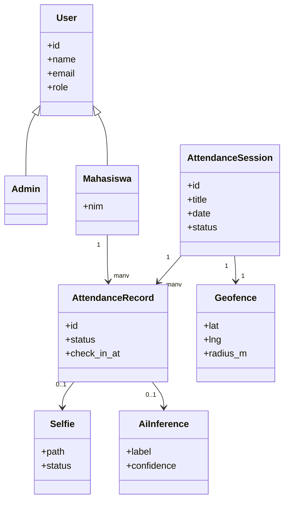
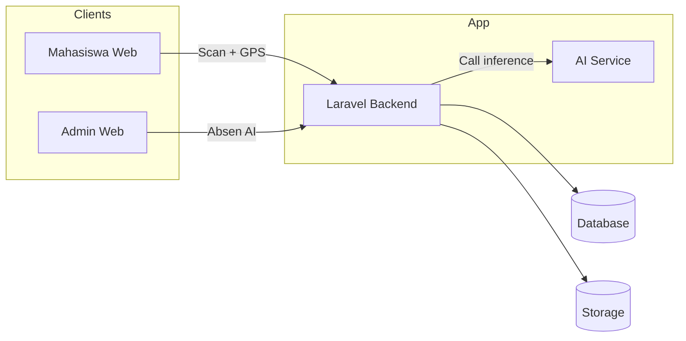

# TPLK004 - Sistem Absensi AI

<p align="left">
  
</p>
<p align="left">
  
</p>

<p align="left">
  
  
  
  
  
</p>


## Ringkasan
TPLK004 adalah sistem absensi mahasiswa berbasis web dengan validasi lokasi (geofence) dan
deteksi kamera untuk membantu absensi lebih akurat. Backend memakai Laravel, frontend React
(Inertia + Vite), dan layanan AI terpisah menggunakan Python (FastAPI + YOLO).

## Fitur Utama
- Admin dashboard untuk monitoring absensi, sesi, dan data mahasiswa.
- Geofence: batas lokasi absensi yang bisa diatur admin.
- Verifikasi selfie: admin bisa approve/reject selfie.
- Absen AI: deteksi kamera admin untuk mencatat absensi otomatis.
- Mahasiswa: absensi dengan kamera + lokasi otomatis (tanpa input manual).
- Rekap dan bukti masuk di sisi mahasiswa.


## Stack dan Tools
- Backend: Laravel, PHP, MySQL
- Frontend: React, Inertia, Vite, Tailwind CSS
- AI Service: Python, FastAPI, Uvicorn, Ultralytics YOLO, PyTorch, OpenCV
- Utilities: Leaflet (peta), QR, dan komponen UI

## Diagram UML dan Arsitektur
### Use Case Diagram (Umum)


### Activity Diagram (Absensi Mahasiswa)


### Class Diagram (High Level)


### Diagram Konseptual / High-Level Architecture

<p align="left">
  
</p>


## Dokumentasi Lengkap
Lihat `docs/DOKUMENTASI.md` untuk panduan lengkap (alur, modul, konfigurasi, dan troubleshooting).


## Legal & Kepatuhan
- Kebijakan privasi tersedia di `/privacy` (lihat `resources/js/pages/privacy.tsx`).
- Persetujuan penggunaan kamera/lokasi ditampilkan sebelum scan.
- Penghapusan data dilakukan melalui admin kampus setelah verifikasi.


## Setup Lokal (Singkat)
### 1) Backend (Laravel)
```bash
composer install
cp .env.example .env
php artisan key:generate
php artisan migrate --seed
php artisan storage:link
php artisan serve --host=127.0.0.1 --port=8000
```

### 2) Frontend (Vite)
```bash
npm install
npm run dev
```

### 3) AI Service (YOLO)
```bash
cd TPLK004-service
python -m venv .venv
source .venv/bin/activate
pip install -r requirements.txt
export DEVICE=mps
export MODEL_PATH=models/yolov8m.pt
export PYTORCH_ENABLE_MPS_FALLBACK=1
uvicorn app:app --host 127.0.0.1 --port 9001
```

### 4) Env untuk integrasi AI (Laravel)
Set di `.env` utama:
```
YOLO_SERVICE_URL=http://127.0.0.1:9001
YOLO_API_KEY=
YOLO_MIN_CONF=0.6
YOLO_TARGET_LABEL=
YOLO_MAINTENANCE_MODE=true
```

## Port Default
- Laravel: `http://127.0.0.1:8000`
- Vite: `http://127.0.0.1:5173`
- YOLO Service: `http://127.0.0.1:9001`


## SOP Admin
<p align="left">
  
</p>
### A. Set Geofence (Zona 100 Meter)
1. Login sebagai admin.
2. Buka menu `Zona 100 Meter`.
3. Klik `Pindai lokasi saat ini` atau geser pin di peta.
4. Atur radius (mis. 100m).
5. Klik `Simpan geofence`.

### B. Validasi Selfie
1. Buka menu `Verifikasi Selfie`.
2. Pilih data mahasiswa yang pending.
3. Cek foto selfie dan detail absensi.
4. Klik `Approve` atau `Reject` dan simpan catatan.

### C. Absen AI (Admin Kamera)
1. Buka menu `Absen AI`.
2. Pilih mahasiswa target (jika tersedia).
3. Klik `Mulai kamera`.
4. Tunggu hasil deteksi, lalu klik `Scan sekali` jika perlu.


## SOP Mahasiswa (Cara Scan)
<p align="left">
  
</p>
1. Login sebagai mahasiswa.
2. Buka halaman `Absen`.
3. Izinkan akses kamera dan lokasi.
4. Pastikan berada di dalam radius geofence.
5. Tampilkan wajah di kamera hingga status terverifikasi.
6. Jika diminta selfie, ambil foto sesuai instruksi.


## Flow Troubleshooting (Cepat)
<p align="left">
  
</p>
### 1) Web tidak bisa dibuka
- Pastikan `php artisan serve` berjalan.
- Cek URL yang benar (localhost atau domain hosting).

### 2) Kamera tidak muncul
- Pastikan izin kamera di browser aktif.
- Gunakan HTTPS di hosting (kamera butuh HTTPS).
- Tutup aplikasi lain yang memakai kamera.

### 3) Lokasi ditolak / di luar radius
- Aktifkan GPS di browser.
- Cek geofence di menu `Zona 100 Meter`.
- Pastikan radius tidak terlalu kecil.

### 4) Absen AI tidak mendeteksi
- Pastikan YOLO service hidup di port 9001.
- Cek `YOLO_SERVICE_URL` di `.env`.
- Periksa apakah `YOLO_API_KEY` cocok (jika dipakai).

### 5) Foto selfie tidak tampil di admin
- Jalankan `php artisan storage:link`.
- Pastikan folder `storage/app/public` dapat diakses.

### 6) CSS/JS tidak muncul di hosting
- Jalankan `npm run build` sebelum upload.
- Pastikan folder `public/build` ikut ter-upload.


## Catatan Hosting
- Gunakan `.env` produksi terpisah.
- Pastikan `APP_URL` sesuai domain.
- Gunakan SSL agar kamera dan lokasi berjalan.

## Referensi Layanan AI
Lihat `TPLK004-service/README.md` untuk detail service YOLO, endpoint, dan konfigurasi.
# TPLK004
