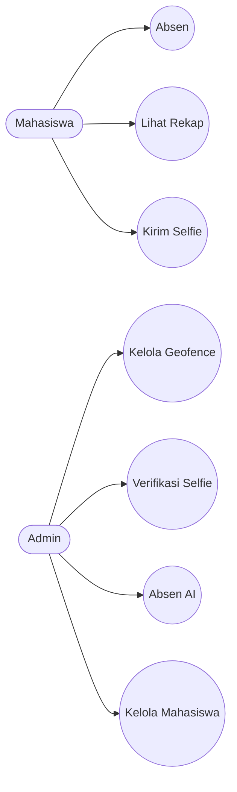
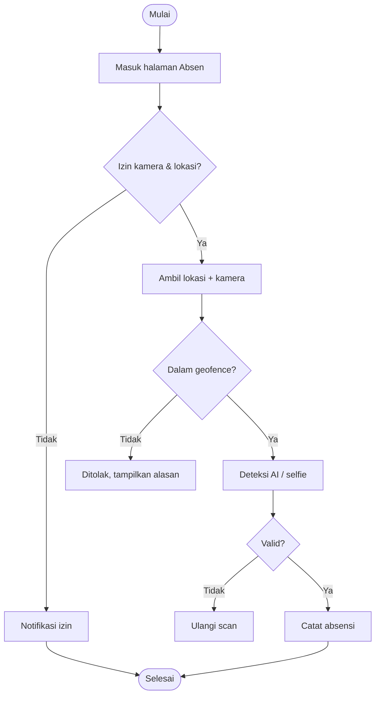
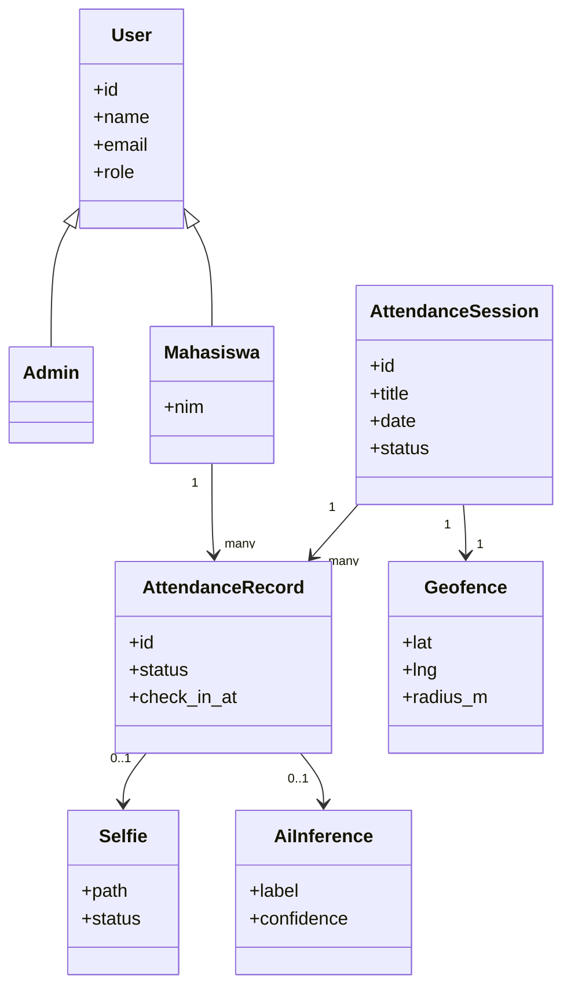
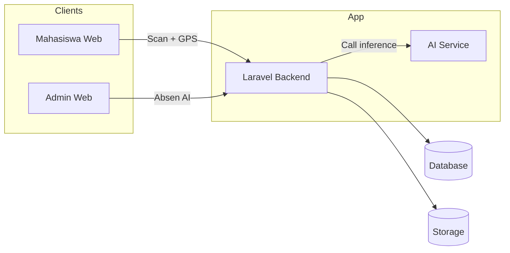

<p align="center">
  
</p>

<h1 align="center">TPLK004 - Sistem Absensi AI</h1>

<p align="center">
  
</p>

<p align="center">
  
</p>
<p align="center">
  
</p>

<p align="center">
  
  
  
  
  
  
</p>


## Daftar Isi
- [Ringkasan](#ringkasan)
- [Tujuan Proyek](#tujuan-proyek)
- [Fitur Utama](#fitur-utama)
- [Tech Stack Detail](#tech-stack-detail)
- [Struktur Sistem dan Modul](#struktur-sistem-dan-modul)
- [Diagram UML dan Arsitektur](#diagram-uml-dan-arsitektur)
- [Dokumentasi Lengkap](#dokumentasi-lengkap)
- [Konfigurasi Kunci](#konfigurasi-kunci)
- [Setup Lokal](#setup-lokal)
- [Port Default](#port-default)
- [SOP Admin](#sop-admin)
- [SOP Mahasiswa](#sop-mahasiswa)
- [Flow Troubleshooting](#flow-troubleshooting)
- [Catatan Hosting](#catatan-hosting)
- [Legal dan Kepatuhan](#legal-dan-kepatuhan)
- [Referensi Layanan AI](#referensi-layanan-ai)


## Ringkasan
-  TPLK004 adalah sistem absensi mahasiswa berbasis web yang menggabungkan geofence dan verifikasi kamera (AI + selfie) agar kehadiran valid.
-  Backend Laravel bertugas mengorkestrasi proses: menerima request, validasi lokasi, memanggil AI Service, lalu mencatat hasil.
-  Geofence memastikan mahasiswa berada di radius yang ditentukan sebelum absensi diterima.
-  Semua aktivitas tersimpan sebagai audit trail (waktu, lokasi, selfie, status) untuk rekap dan verifikasi.


## Tujuan Proyek
-  Mengurangi kecurangan absensi melalui kombinasi lokasi dan verifikasi visual.
-  Menyediakan dashboard admin yang ringkas dan mudah diaudit.
-  Menjaga pengalaman mahasiswa tetap sederhana tanpa input manual berulang.


## Fitur Utama
-  Dashboard admin untuk memonitor sesi, rekap, dan status absensi.
-  Geofence dinamis: admin dapat menetapkan titik pusat dan radius absensi.
-  Verifikasi selfie untuk approval atau penolakan oleh admin.
-  Absen AI: deteksi kamera admin untuk mencatat absensi otomatis.
-  Mahasiswa melakukan absen dengan kamera + lokasi otomatis.
-  Rekap absensi dan bukti masuk tersedia di sisi mahasiswa.


## Tech Stack Detail
-  Versi di bawah mengikuti dependensi yang tercatat pada repository ini.

### Frontend Core
<p>
  
  
  
  
  
</p>

### UI dan Utilities
<p>
  
  
  
  
  
  
  
</p>

### Backend
<p>
  
  
  
  
  
</p>

### AI Service
<p>
  
  
  
  
  
  
</p>

### Dev Tools
<p>
  
  
  
</p>


## Struktur Sistem dan Modul
-  Aplikasi dibagi menjadi frontend, backend, dan AI service agar proses absensi terukur dan mudah dipelihara.

### Peran Pengguna
-  Admin: kelola geofence, verifikasi selfie, jalankan absen AI, dan kelola data mahasiswa.
-  Mahasiswa: absen dengan kamera + lokasi otomatis dan melihat rekap.

### Modul Admin
-  Dashboard ringkas untuk status sesi, statistik, dan rekap.
-  Zona 100 Meter untuk mengatur titik dan radius absensi.
-  Verifikasi selfie mahasiswa (approve/reject) dengan catatan.
-  Absen AI untuk deteksi kamera admin dan auto-record ke database.

### Modul Mahasiswa
-  Absensi berbasis kamera + lokasi tanpa input manual.
-  Rekap dan bukti masuk tersimpan untuk audit dan histori.

### Modul AI Service
-  Endpoint inference YOLO untuk deteksi objek/wajah sesuai kebutuhan.
-  Dipanggil melalui backend sebagai proxy untuk menghindari CORS.
-  Mendukung API key dan batasan payload untuk keamanan.


## Diagram UML dan Arsitektur
-  Diagram berikut merangkum alur utama, struktur data, dan hubungan antar modul.

### Use Case Diagram (Umum)


### Activity Diagram (Absensi Mahasiswa)


### Class Diagram (High Level)


### Diagram Konseptual / High-Level Architecture

-  Backend menjadi penghubung utama antara UI, database, storage, dan AI service.
-  Data absensi, selfie, dan metadata disimpan terpusat untuk audit.
-  AI service hanya menangani inference agar proses inti tetap cepat dan terisolasi.


## Dokumentasi Lengkap
-  Lihat `docs/DOKUMENTASI.md` untuk detail alur, modul, konfigurasi, dan troubleshooting.


## Konfigurasi Kunci
### Laravel (.env)
-  `YOLO_SERVICE_URL` mengarah ke AI service yang menerima request inference.
-  `YOLO_API_KEY` dipakai jika endpoint inference dilindungi.
-  `YOLO_MIN_CONF` menentukan batas confidence minimal.
-  `LOCATION_*` mengatur sampling lokasi dan anti-spoofing.
```
YOLO_SERVICE_URL=http://127.0.0.1:9001
YOLO_API_KEY=
YOLO_MIN_CONF=0.6
YOLO_TARGET_LABEL=
YOLO_MAINTENANCE_MODE=true

LOCATION_SAMPLE_COUNT=3
LOCATION_SAMPLE_WINDOW_SECONDS=20
LOCATION_SAMPLE_MAX_AGE_SECONDS=60
LOCATION_MAX_SPEED_MPS=35
LOCATION_MAX_JUMP_M=150
LOCATION_MAX_SPREAD_M=100
```

### AI Service (.env)
-  `MODEL_PATH` menentukan model YOLO yang dipakai.
-  `DEVICE`, `CONF`, dan `IMGSZ` mengatur performa inference.
-  `API_KEY` opsional untuk mengamankan endpoint.
```
MODEL_PATH=models/yolov8m.pt
DEVICE=auto
CONF=0.25
IOU=0.45
IMGSZ=640
API_KEY=
INFER_CONCURRENCY=1
MAX_IMAGE_BYTES=8388608
```


## Setup Lokal
### 1) Backend (Laravel)
-  Menyiapkan dependensi PHP, key aplikasi, migrasi, dan storage link.
```bash
composer install
cp .env.example .env
php artisan key:generate
php artisan migrate --seed
php artisan storage:link
php artisan serve --host=127.0.0.1 --port=8000
```

### 2) Frontend (Vite)
-  Menjalankan bundler Vite untuk UI React.
```bash
npm install
npm run dev
```

### 3) AI Service (YOLO)
-  Menjalankan FastAPI + YOLO pada port 9001.
```bash
cd TPLK004-service
python -m venv .venv
source .venv/bin/activate
pip install -r requirements.txt
export DEVICE=mps
export MODEL_PATH=models/yolov8m.pt
export PYTORCH_ENABLE_MPS_FALLBACK=1
uvicorn app:app --host 127.0.0.1 --port 9001
```

### 4) Env untuk integrasi AI (Laravel)
-  Pastikan Laravel mengarah ke AI service yang aktif.
```
YOLO_SERVICE_URL=http://127.0.0.1:9001
YOLO_API_KEY=
YOLO_MIN_CONF=0.6
YOLO_TARGET_LABEL=
YOLO_MAINTENANCE_MODE=true
```


## Port Default
-  Laravel: `http://127.0.0.1:8000`
-  Vite: `http://127.0.0.1:5173`
-  YOLO Service: `http://127.0.0.1:9001`


## SOP Admin
### A. Set Geofence (Zona 100 Meter)
1.  Login sebagai admin.
2.  Buka menu `Zona 100 Meter`.
3.  Klik `Pindai lokasi saat ini` atau geser pin di peta.
4.  Atur radius (mis. 100m).
5.  Klik `Simpan geofence`.

### B. Validasi Selfie
1.  Buka menu `Verifikasi Selfie`.
2.  Pilih data mahasiswa yang pending.
3.  Cek foto selfie dan detail absensi.
4.  Klik `Approve` atau `Reject` lalu simpan catatan.

### C. Absen AI (Admin Kamera)
1.  Buka menu `Absen AI`.
2.  Pilih mahasiswa target (jika tersedia).
3.  Klik `Mulai kamera`.
4.  Tunggu hasil deteksi, lalu klik `Scan sekali` jika perlu.


## SOP Mahasiswa (Cara Scan)
1.  Login sebagai mahasiswa.
2.  Buka halaman `Absen`.
3.  Izinkan akses kamera dan lokasi.
4.  Pastikan berada di dalam radius geofence.
5.  Tampilkan wajah di kamera hingga status terverifikasi.
6.  Jika diminta selfie, ambil foto sesuai instruksi.


## Flow Troubleshooting
### 1) Web tidak bisa dibuka
-  Pastikan `php artisan serve` berjalan.
-  Cek URL yang benar (localhost atau domain hosting).

### 2) Kamera tidak muncul
-  Pastikan izin kamera di browser aktif.
-  Gunakan HTTPS di hosting (kamera butuh HTTPS).
-  Tutup aplikasi lain yang memakai kamera.

### 3) Lokasi ditolak / di luar radius
-  Aktifkan GPS di browser.
-  Cek geofence di menu `Zona 100 Meter`.
-  Pastikan radius tidak terlalu kecil.

### 4) Absen AI tidak mendeteksi
-  Pastikan YOLO service hidup di port 9001.
-  Cek `YOLO_SERVICE_URL` di `.env`.
-  Periksa apakah `YOLO_API_KEY` cocok (jika dipakai).

### 5) Foto selfie tidak tampil di admin
-  Jalankan `php artisan storage:link`.
-  Pastikan folder `storage/app/public` dapat diakses.

### 6) CSS/JS tidak muncul di hosting
-  Jalankan `npm run build` sebelum upload.
-  Pastikan folder `public/build` ikut ter-upload.


## Catatan Hosting
-  Gunakan `.env` produksi terpisah.
-  Pastikan `APP_URL` sesuai domain.
-  Gunakan SSL agar kamera dan lokasi berjalan.


## Legal dan Kepatuhan
-  Kebijakan privasi tersedia di `/privacy` (lihat `resources/js/pages/privacy.tsx`).
-  Persetujuan penggunaan kamera dan lokasi ditampilkan sebelum scan.
-  Penghapusan data dilakukan melalui admin kampus setelah verifikasi.

<div align="center">
  
</div>


## Referensi Layanan AI
-  Lihat `TPLK004-service/README.md` untuk detail service YOLO, endpoint, dan konfigurasi.
