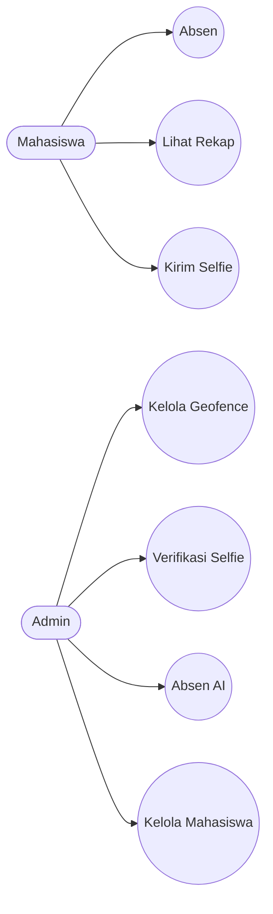
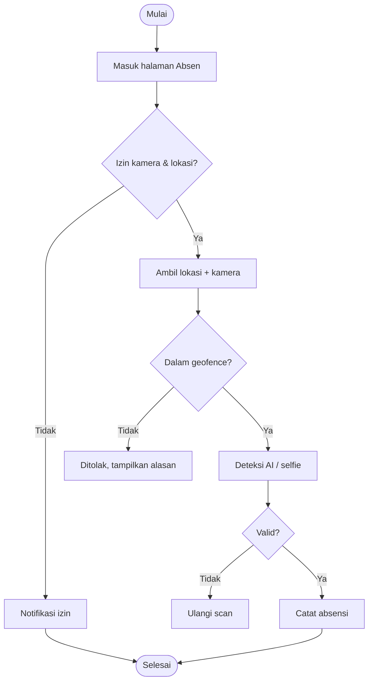
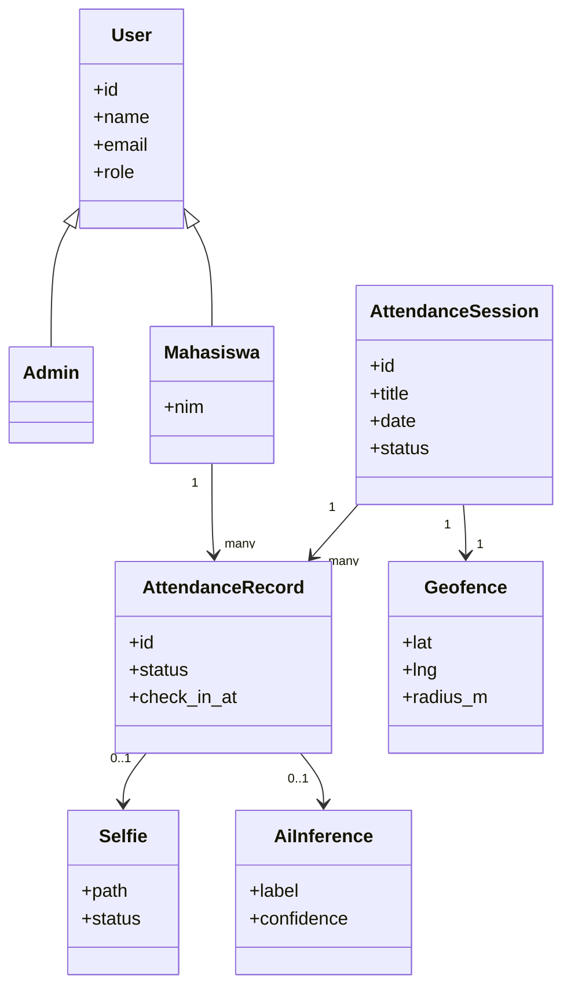
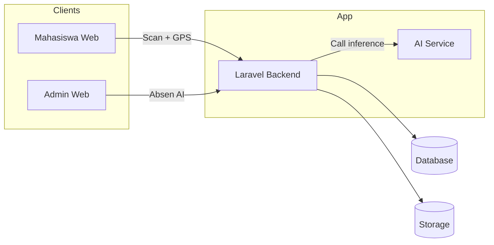

# Dokumentasi TPLK004 - Sistem Absensi AI

## Ringkasan
TPLK004 adalah sistem absensi mahasiswa berbasis web dengan validasi lokasi (geofence) dan
verifikasi kamera (AI + selfie). Proyek ini terdiri dari:
- Backend: Laravel (API + bisnis logic)
- Frontend: React (Inertia + Vite)
- AI Service: Python (FastAPI + YOLO)

## Tujuan
- Mengurangi kecurangan absensi.
- Menyatukan proses absensi, geofence, dan verifikasi selfie.
- Menyediakan dashboard admin yang mudah diaudit.

## Peran & Akses
- **Admin**: kelola geofence, verifikasi selfie, jalankan Absen AI, kelola mahasiswa.
- **Mahasiswa**: absen dengan kamera + lokasi otomatis, lihat rekap.

## Modul Utama
### 1) Admin
- Dashboard ringkas sesi, rekap, dan status.
- **Zona 100 Meter** (geofence): set titik dan radius absensi.
- **Verifikasi Selfie**: approve/reject selfie mahasiswa.
- **Absen AI**: deteksi kamera admin untuk absensi otomatis.

### 2) Mahasiswa
- Absensi dengan kamera + lokasi (tanpa input manual).
- Rekap dan bukti masuk.

### 3) AI Service (YOLO)
- Endpoint inference untuk deteksi.
- Dipanggil oleh backend (proxy) untuk menghindari CORS.

## Alur Absensi (Mahasiswa)
1. Mahasiswa membuka halaman absen.
2. Browser meminta izin kamera + lokasi.
3. Sistem mengambil beberapa sampel lokasi.
4. Validasi geofence (harus dalam radius).
5. Kamera aktif, selfie dan/atau AI diverifikasi.
6. Absensi dicatat di database.

## Alur Absen AI (Admin)
1. Admin membuka menu Absen AI.
2. Kamera admin aktif.
3. Backend memanggil AI Service saat scan.
4. Jika confidence memenuhi batas, absensi tercatat.

## Konfigurasi Penting
### .env (Laravel)
```
APP_URL=
YOLO_SERVICE_URL=http://127.0.0.1:9001
YOLO_API_KEY=
YOLO_MIN_CONF=0.6
YOLO_TARGET_LABEL=
YOLO_MAINTENANCE_MODE=true

LOCATION_SAMPLE_COUNT=3
LOCATION_SAMPLE_WINDOW_SECONDS=20
LOCATION_SAMPLE_MAX_AGE_SECONDS=60
LOCATION_MAX_SPEED_MPS=35
LOCATION_MAX_JUMP_M=150
LOCATION_MAX_SPREAD_M=100
```

### .env (YOLO Service)
```
MODEL_PATH=models/yolov8m.pt
DEVICE=auto
CONF=0.25
IOU=0.45
IMGSZ=640
API_KEY=
INFER_CONCURRENCY=1
MAX_IMAGE_BYTES=8388608
```

## Struktur Folder (Ringkas)
- `app/` : Controller, model, logic utama
- `resources/js/` : React pages & components
- `routes/` : web routes
- `public/` : assets dan build Vite
- `TPLK004-service/` : AI service (FastAPI + YOLO)
- `storage/` : upload + cache

## Setup Lokal (Ringkas)
### Backend
```bash
composer install
cp .env.example .env
php artisan key:generate
php artisan migrate --seed
php artisan storage:link
php artisan serve --host=127.0.0.1 --port=8000
```

### Frontend
```bash
npm install
npm run dev
```

### AI Service
```bash
cd TPLK004-service
python -m venv .venv
source .venv/bin/activate
pip install -r requirements.txt
export DEVICE=mps
export MODEL_PATH=models/yolov8m.pt
export PYTORCH_ENABLE_MPS_FALLBACK=1
uvicorn app:app --host 127.0.0.1 --port 9001
```

## Deployment (Ringkas)
- Jalankan `npm run build` dan upload `public/build`.
- Set `.env` produksi.
- Pastikan `storage` bisa ditulis dan `php artisan storage:link` sudah dibuat.
- Gunakan HTTPS agar kamera dan lokasi bisa berjalan.

## Troubleshooting Umum
- **Web tidak bisa dibuka**: pastikan server berjalan.
- **Kamera tidak aktif**: cek izin browser dan HTTPS.
- **Lokasi ditolak**: aktifkan GPS dan periksa geofence.
- **AI tidak mendeteksi**: pastikan AI service berjalan dan URL sesuai.
- **Asset tidak tampil**: pastikan `public/build` ter-upload.

## Legal & Kepatuhan
### Kebijakan Privasi (Ringkas)
- Data yang dikumpulkan: identitas mahasiswa, foto selfie, lokasi, waktu, dan informasi perangkat.
- Tujuan: validasi kehadiran, audit absensi, dan kebutuhan akademik.
- Akses: hanya petugas/admin berwenang sesuai kebijakan kampus.
- Dokumen lengkap dapat dibaca di halaman `/privacy`.

### Persetujuan Penggunaan Kamera
- Penggunaan kamera dan lokasi harus disetujui sebelum memulai proses absensi.
- Persetujuan ditampilkan di UI dan disimpan di perangkat untuk memudahkan penggunaan berikutnya.

### Prosedur Penghapusan Data
- Mahasiswa dapat mengajukan permintaan penghapusan data ke admin kampus.
- Admin melakukan verifikasi identitas sebelum menghapus data.
- Data yang dihapus meliputi catatan absensi, selfie, dan metadata terkait.

## Diagram UML & Arsitektur
### Use Case Diagram (Umum)


### Activity Diagram (Absensi Mahasiswa)


### Class Diagram (High Level)


### Diagram Konseptual / High-Level Architecture

